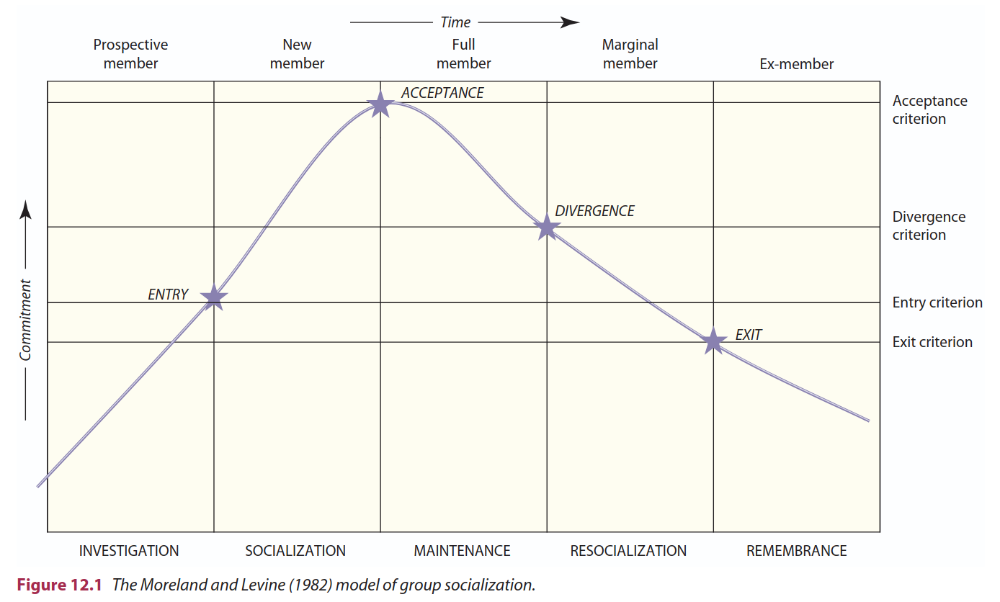
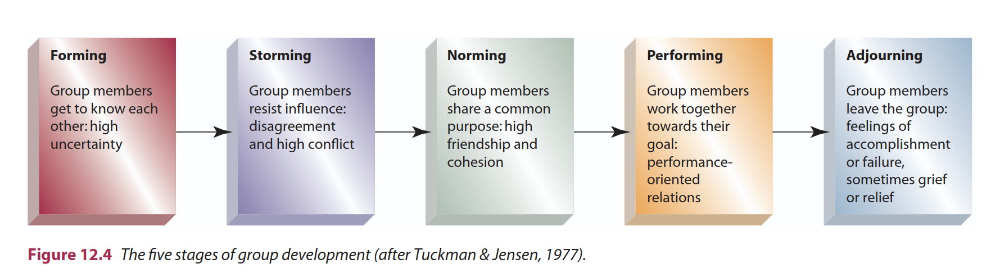
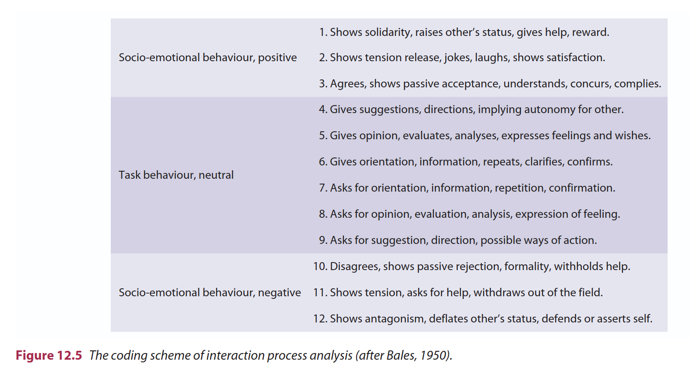
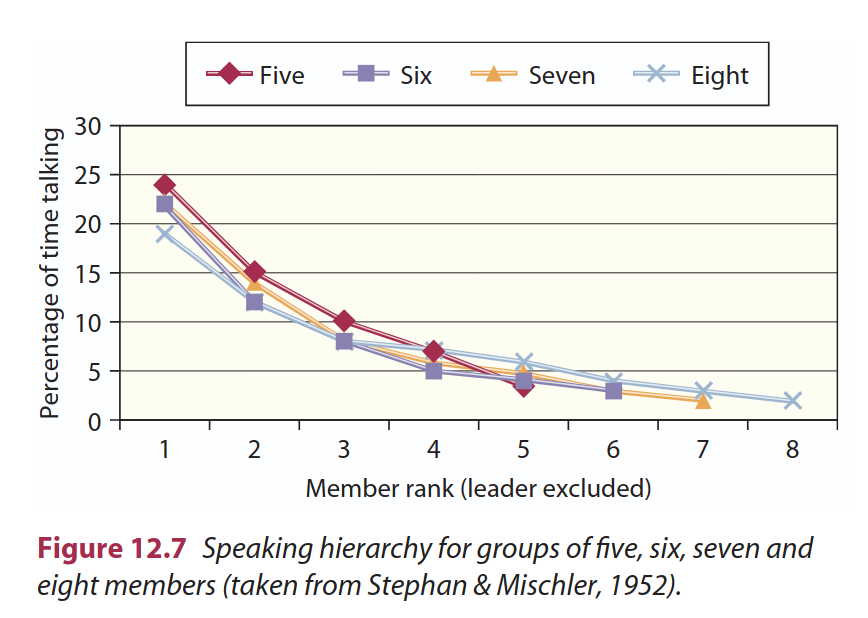

class:center, middle, bg_karl

```{r setup, include=FALSE}
options(htmltools.dir.version = FALSE)
knitr::opts_chunk$set(
  fig.width=9, fig.height=3.5, fig.retina=3,
  out.width = "100%",
  cache = FALSE,
  echo = FALSE,
  message = FALSE, 
  warning = FALSE,
  hiline = TRUE
)
```


```{r xaringan-themer, include=FALSE, warning=FALSE}
library(knitr)
library(xaringanthemer)
style_duo_accent(
  primary_color = "#b01333",
  secondary_color = "#085e9f",
  inverse_header_color = "#FFFFFF"
)
```
```{css, echo=F}
h1, h2, h3 {
  text-align: center;
}
```


```{css, echo = F}

.reduced_opacity {
  opacity: 0.3;
}

.image-container {
  display: flex;
  justify-content: center;
  align-items: center;
}

.image-container img {
  margin: 0 10px;
  height: 100px; /* Ajusta la altura según sea necesario */
}

.bg_karl {
  position: relative;
  z-index: 1;
}
.bg_karl::before {    
      content: "";
      background-image: url('');
      background-size: cover;
      background-position:top;
      position: absolute;
      top: 0px;
      right: 0px;
      bottom: -10px;
      left: 0px;
      opacity: 0.3;
      z-index: -1;
}

#penn-logo {
  width: 330px; /* Adjust the width as needed */
  height: auto; /* Maintain the aspect ratio */
}

#faro-logo {
  width: 400px; /* Adjust the width as needed */
  height: auto; /* Maintain the aspect ratio */
}

```

## Curso Psicología de los Grupos
### Clase 1: ¿Qué es un grupo?

<br>


<center><strong>Francisco Villarroel-Riquelme (CICS, UDD</strong></center>


   [fvillarroelr@udd.cl](mailto:fvillarroelr@udd.cl)


<br>

```{r, echo=FALSE, fig.align='center', out.width="20%"}


```


---
background-image: url(clase1_files/logo_psicologia_UDD.png)
background-size: 150px
background-position: 97% 97%

# ¿Qué veremos hoy?

- Normas y reglas del profesor
- Exposición del programa del curso
- Responder la pregunta: ¿Qué es un grupo?

---
background-image: url(clase1_files/logo_psicologia_UDD.png)
background-size: 150px
background-position: 97% 97%
class: left, middle


## ¿Quién es el profesor?

- Licenciado en Historia, U de Chile (2017)
- Magíster en Ciencias Sociales, mención estudios de la sociedad Civil, IDEA-USACH (2022)
- Candidato a Doctor en Ciencias de la Complejidad Social, CICS-UDD
 
--
 
**Interés:** Ciencias Sociales experimentales, Influencia social, normas sociales
 
--
 
**Trabajos actuales**: Líderes y toma de decisiones, cámaras de eco y fake news, lazos sociales e intolerencia política


---
background-image: url(clase1_files/logo_psicologia_UDD.png)
background-size: 150px
background-position: 97% 97%

### Normas del curso


- **Puntualidad:** Los estudiantes tienen posibilidad de entrar 25min después de iniciada la sesión

--

- **Y si Llegó tarde?** No hay problema. espere afuera hasta el break.

--

- **La diapo no es todo:** **No escriban lo que está en la diapo, escriban reflexiones y datos que se dan en clases.**

--

- **Diálogo y debate:** Se invita a los estudiantes a participar. ¡Hay nota por ello!

--

- **Chat GPT:** En algunos trabajos se pedirá el uso de ChatGPT. _No está prohibido, pero sea cauto_

-- 

- **Creatividad y pensamiento crítico:** A la universidad se viene a pensar y a crear. El debate está siempre abierto.

--

- **La Asistencia mínima del curso es 70%**

--

- **_"Profesor, puedo tener nota recuperativa?"_**: Sí. está calendarizado.

--

- **Perdón, me cuesta aprender nombres**

--

- Si tiene alguna complicación, favor mandar correo: [fvillarroelr@udd.cl](mailto:fvillarroelr@udd.cl)


---
background-size: 160px
background-position: 97% 2%
class: left, middle

## Programa

Esta asignatura busca desarrollar la capacidad de integrar las contribuciones teóricas y técnicas de la psicología para analizar y comprender críticamente las distintas dimensiones de fenómenos psicosociales, así como los contextos sociohistóricos y culturales en los cuales estos ocurren.  

La asignatura presenta al estudiante los diferentes enfoques y fenómenos de la interacción de los individuos en el grupo a partir de las bases sociales de la conducta.  

Tiene un carácter teórico-práctico y analiza los procesos intragrupales, intergrupales y colectivos que permiten comprender el comportamiento humano en contexto.

---
background-size: 160px
background-position: 97% 2%
class: left, middle


## Unidades principales

- Introducción a la Psicología de los grupos  
- Técnicas grupales aplicadas a la investigación  
- Procesos de grupo en diversos contextos  

---
background-size: 160px
background-position: 97% 2%
class: inverse, middle, center


## Evaluaciones


---
background-size: 160px
background-position: 97% 2%
class: left, middle


**Evaluaciones parciales:** 70% de la nota final  

- 2 Certámenes acumulativos (uno individual y otro grupal): 35% cada uno  

**Participación en clases** Acumula décimas para cada certamen!

**Trabajos clase a clase:** 30%  

**Examen final:** 30% de la nota final  


---
background-size: 160px
background-position: 97% 2%
class: inverse, middle, center


## ¿Qué es un grupo?


---
background-size: 160px
background-position: 97% 2%
class: inverse, middle, center


## >_"Un grupo consiste en dos o más personas que comparten metas comunes, tienen una relación estable, son en cierto sentido interdependientes y percioben que en realidad forman parte de un grupo"_ (Paulus,1989)


---
background-size: 160px
background-position: 97% 2%
class: left, middle

## ¿Qué hace que un grupo sea tal?


.left-column[

1.Destino común?
2.Estructura interna?
3.Conciencia de membresía?

]


.right-column[


]


---
background-size: 160px
background-position: 97% 2%
class: left, middle

## Por qué formamos grupos?

* Ventaja evolutiva de los grupos
* Necesidad de pertenencia
* Grupos amplían cognición social
* Reduce incertidumbre
* Se satisfacen necesidades recíprocas


---
background-size: 160px
background-position: 97% 2%
class: left, middle


## 3 niveles de análisis grupal


.left-column[

1. Nivel individual
2. Nivel grupal
3. Contexto social

]


.right-column[

1. Individuos conscientes la membresía a un grupo
2. La combinatoria de estos grupos genera _comportamientos emergentes_
3. Contexto social afecta cómo el grupo se comporta

]

---
background-size: 160px
background-position: 97% 2%
class: left, middle


### Nivel indvidual de grupos

--

* Individuos se adaptan a los grupos exuistentes en el entorno
* Normas internas en los grupos conducen conducta
* Individuos deben aprender e incorporarlas


---
background-size: 160px
background-position: 97% 2%
class: left, middle


```{r, out.width="90%"}

```


---
background-size: 160px
background-position: 97% 2%
class: left, middle


### Nivel grupal

* Grupos pueden ser estructurados o más espontáneos
* Tienen su propia dinámica interna
* Conforman normas y emociones conjuntas
* Cognición compartida
* Dependientes de la cohesión social
* Modelo IPA para análisis
* Comportamientos basados en tareas y comportamientos socio-emocionales


---
background-size: 160px
background-position: 97% 2%
class: left, middle


```{r, fig.align='center'}

```

---

```{r}

```


---
background-size: 160px
background-position: 97% 2%
class: left, middle

## Status y rol

* Grupos tienen miembros "diferentes" en torno a cómo se comportan hacia y para el grupo
* Deporte caso clásico de roles
* Cuánto y cómo hablan los miembros de un grupo?
* Surgimiento de líderes

---


```{r}

```


---
background-size: 160px
background-position: 97% 2%
class: left, middle


### Contexto social

__ej: Ser hincha de futbol en el estadio y en la casa es distinto__

* Ser miembro de un grupo no siempre está presente como primer elemento
* Saliencia del grupo activa la membresía
* Confrontación intergrupal apela a saliencia para alinear pensamientos y comportamiento


---
background-size: 160px
background-position: 97% 2%
class: left, middle


<center>
<iframe width="560" height="315" src="https://www.youtube.com/embed/GDc2eCLFexQ?si=xxVZ4aBtWHQjnAJQ" title="YouTube video player" frameborder="0" allow="accelerometer; autoplay; clipboard-write; encrypted-media; gyroscope; picture-in-picture; web-share" referrerpolicy="strict-origin-when-cross-origin" allowfullscreen></iframe></center>


---
class: inversed, center, middle
background-image: url(https://user-images.githubusercontent.com/163582/45438104-ea200600-b67b-11e8-80fa-d9f2a99a03b0.png)
background-size: 80px
background-position: 50% 90%

# ¡Gracias!


###fvillarroelr@udd.cl

Slide creado con el paquete [**xaringan**](https://github.com/yihui/xaringan).


El  chakra viene de [remark.js](https://remarkjs.com), [**knitr**](https://yihui.org/knitr/), y [R Markdown](https://rmarkdown.rstudio.com).
Este slide fue creado por [**xaringan**](https://github.com/yihui/xaringan) y [**XaringanThemer**](https://pkg.garrickadenbuie.com/xaringanthemer/index.html)

