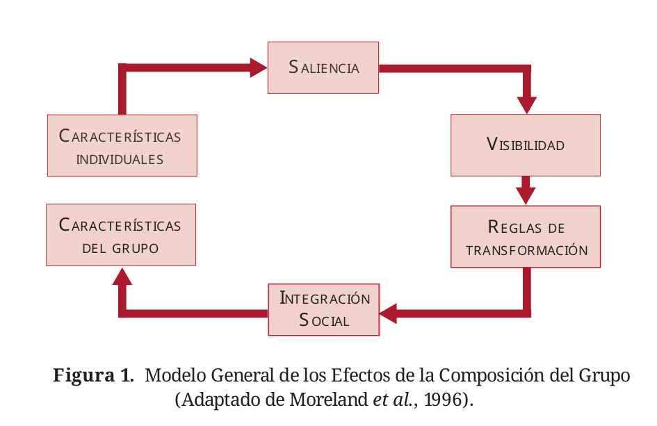
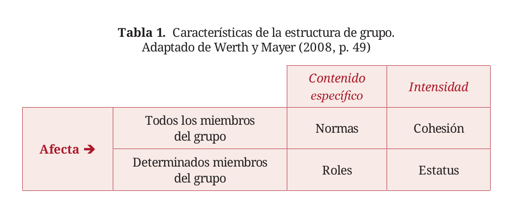

class:left, middle, bg_karl

```{r setup, include=FALSE}
options(htmltools.dir.version = FALSE)
knitr::opts_chunk$set(
  fig.width=9, fig.height=3.5, fig.retina=3,
  out.width = "100%",
  cache = FALSE,
  echo = FALSE,
  message = FALSE, 
  warning = FALSE,
  hiline = TRUE
)
```


```{r xaringan-themer, include=FALSE, warning=FALSE}
library(knitr)
library(xaringanthemer)
style_duo_accent(
  primary_color = "#b01333",
  secondary_color = "#085e9f",
  inverse_header_color = "#FFFFFF"
)
```
```{css, echo=F}
h1, h2, h3 {
  text-align: left;
}
```


```{css, echo = F}

.reduced_opacity {
  opacity: 0.3;
}

.image-container {
  display: flex;
  justify-content: left;
  align-items: left;
}

.image-container img {
  margin: 0 10px;
  height: 100px; /* Ajusta la altura según sea necesario */
}

.bg_karl {
  position: relative;
  z-index: 1;
}
.bg_karl::before {    
      content: "";
      background-image: url('https://thumbs.dreamstime.com/b/groups-people-14965088.jpg');
      background-size: cover;
      background-position:top;
      position: absolute;
      top: 0px;
      right: 0px;
      bottom: -10px;
      left: 0px;
      opacity: 0.3;
      z-index: -1;
}

#penn-logo {
  width: 330px; /* Adjust the width as needed */
  height: auto; /* Maintain the aspect ratio */
}

#faro-logo {
  width: 400px; /* Adjust the width as needed */
  height: auto; /* Maintain the aspect ratio */
}

```

## Curso Psicología de los Grupos
### Clase 1: Tipología de grupos y teorías

<br>


<left><strong>Francisco Villarroel-Riquelme (CICS, UDD</strong></left>


   [fvillarroelr@udd.cl](mailto:fvillarroelr@udd.cl)


<br>

```{r, echo=FALSE, fig.align='center', out.width="20%"}


knitr::include_graphics("clase2_files/logo_psicologia_UDD.png")
```


---
background-image: url(clase2_files/logo_psicologia_UDD.png)
background-size: 150px
background-position: 97% 97%
class: middle, left

## ¿Qué veremos hoy?

- Tipologías de gruop
- Grupo, colectivo, "grupalidad"
- Roles y estatus
- Actividad en clases

---
class: inverse, left, middle


### Sólo por saber: ¿Qué es un grupo?


---
background-image: url(clase2_files/logo_psicologia_UDD.png)
background-size: 150px
background-position: 97% 97%
class: middle, left


```{r, out.width="40%", fig.align='center'}

```


---
background-image: url(clase2_files/logo_psicologia_UDD.png)
background-size: 150px
background-position: 97% 97%
class: middle, left


## Clasificación de Grupos: Según origen

.pull-left[

**Primarios**

- Orientados a la relación.  
- Se conocen íntimamente como personalidades individuales.  
- Contactos sociales informales, íntimos, personales y totales.  
- Base del carácter social humano.  
- Ej: familia, grupo de amigos íntimos.

]

.pull-right[

**Secundarios**

- Orientados a los objetivos.  
- Relaciones frías, impersonales, racionales, contractuales y utilitarias.  
- El grupo es un medio para otros fines específicos.  
- Ej: cursos universitarios, sindicatos.

]


---
background-image: url(clase2_files/logo_psicologia_UDD.png)
background-size: 150px
background-position: 97% 97%
class: middle, left


## Clasificación basada en el grado y origen de la pertenencia


.pull-left[
**Grupo de pertenencia**

- Grupo al que se puede anteponer el pronombre *“mi”*.  
- Ej: grupos políticos, religiosos.

]

.pull-right[

**Grupo de referencia**

- Sirve de modelo aunque no se pertenezca.  
- Sus juicios de valor se convierten en nuestros juicios.

]

---
background-image: url(clase2_files/logo_psicologia_UDD.png)
background-size: 150px
background-position: 97% 97%
class: middle, left

## Funciones de los grupos de referencia


.pull-left[

**Función normativa (social)**

- Las personas que aspiran a pertenecer intentan asimilar normas y valores.  
- Ej: moda, lenguaje, símbolos.

]


.pull-right[

**Función comparativa (psicológica)**

- Punto de comparación social.  
- Ejemplos:  
  - ¿Soy como ellos?  
  - ¿Pienso como ellos?
  
]

---
background-image: url(clase2_files/logo_psicologia_UDD.png)
background-size: 150px
background-position: 97% 97%
class: middle, left


## Clasificación basada en el nivel de formalidad


.pull-left[

**Grupos formales**

- Formados por una organización social.  
- Tienen propósitos específicos y estructura definida.  
- Ej: equipo de fútbol, grupos parroquiales.


]


.pull-right[

**Grupos informales**

- No están estructurados formalmente.  
- Surgen por necesidad de contacto social.  
- Ej: grupo de amigos o conocidos.

]

---
background-image: url(clase2_files/logo_psicologia_UDD.png)
background-size: 150px
background-position: 97% 97%
class: middle, left


## Nivel de formalidad: subtipos


.pull-left[
**Dentro de los grupos formales**

- **Grupos reglados o jerárquicos**  
  - Determinados por normas o estatutos.  
  - Carácter permanente.

- **Grupos de tarea**  
  - Formados según conocimientos o habilidades.  
  - Carácter temporal.
  
]


.pull-right[
**Dentro de los grupos informales**

- **Grupos de interés**  
  - Personas con intereses compartidos.  
  - Ej: coleccionistas, melómanos.

- **Grupos de amigos**  
  - Satisfacen necesidades personales y sociales.
  
  
]

---
background-image: url(clase2_files/logo_psicologia_UDD.png)
background-size: 150px
background-position: 97% 97%
class: middle, left


## Clasificación basada en el carácter de la formación


.pull-left[

**Grupos naturales**

- Existen independientemente del investigador.  
- Ej: familia, grupos de amigos, equipos deportivos, asociaciones.

]

.pull-right[

**Grupos artificiales o experimentales**

- Creados para investigación.  
- Se forman para estudiar procesos grupales o variables específicas.

]

---
background-image: url(clase2_files/logo_psicologia_UDD.png)
background-size: 150px
background-position: 97% 97%
class: left, middle


## Resumen: cómo caracterizar un grupo

Identificar:

- **Origen de la relación**  
  - Primario o secundario.

- **Grado y origen de pertenencia**  
  - Pertenencia o referencia.

- **Nivel de formalidad**  
  - Formal o informal (y subtipos).

- **Carácter de la formación**  
  - Natural o artificial.

---
class: left, middle


Identifique qué grupos son:

1. Un equipo de fútbol amateur que se reúne todos los fines de semana a jugar.

2. El directorio de una empresa que se reúne una vez al mes para tomar decisiones estratégicas.

3. Un grupo de amigos que se juntan regularmente a tocar música.

4. Un comité de estudiantes encargado de organizar la semana universitaria.

5. Un grupo de apoyo para personas que han dejado de fumar.

6. Los seguidores de un influencer en redes sociales.

7. Un equipo de trabajo dentro de una empresa que desarrolla un proyecto específico durante seis meses.

8. Una familia que vive en la misma casa.

9. Personas que hacen fila para comprar entradas para un concierto.

10. Un sindicato de trabajadores de una fábrica.

---
class: inverse,middle, left

## Grupalidad y grupo

---
background-image: url(clase2_files/logo_psicologia_UDD.png)
background-size: 150px
background-position: 97% 97%
class: left, middle

## ¿Grupos o grupalidad?


* No siempre es fácil definir un grupo
* Capacidad de integración para actuar como grupo o miembros aislados
* **Criterios: Tamaño, interdependencia y temporalidad**

---
background-image: url(clase2_files/logo_psicologia_UDD.png)
background-size: 150px
background-position: 97% 97%
class: left, middle

### ¿Puede una diada ser grupo?


1. Son efímeras
2. Emociones más fuertes y diversas que un grupo
3. \+ Simples que un grupo.
4. Metoddológicamente se han estudiado distinto

---
class: inverse,middle, center

## Estructura de los grupos y sus componentes

---
background-image: url(clase2_files/logo_psicologia_UDD.png)
background-size: 150px
background-position: 97% 97%
class: left, middle


## Definición

Del latín *structura*: disposición o configuración que surge del orden de cómo están colocadas las cosas.

Elementos del grupo:

- Consistencia  
- Estabilidad  

> “Un grupo está estructurado cuando adquiere cierta estabilidad en el arreglo de relaciones entre los miembros.”  
(Catwright y Zander, 1971)

> “La relación entre los elementos de una unidad social.”  
(Collins y Raven, 1969)

---
background-image: url(clase2_files/logo_psicologia_UDD.png)
background-size: 150px
background-position: 97% 97%
class: inverse,middle, left

## Tamaño de grupo

- Consecuencia de otros factores? como contexto? como causa de distintos fenómenos?

---
background-image: url(clase2_files/logo_psicologia_UDD.png)
background-size: 150px
background-position: 97% 97%
class: middle, left

## Tamaño de grupo

- Tamaño ideal de grupo: ????


|        Ventajas             |      Desventajas              |
|-----------------------------|-------------------------------|
|  Más recursos               |  \+ problemas de coordinación  |
| Diversidad                  |  Pérdida de motivación        |
| Más legitimidad             | \+ conflicto, - cooperación    |
|                             | \+ conductas antinormativas    |
|                             | \- Satisfacción                |
|                             | \- Participación               |

---
background-image: url(clase2_files/logo_psicologia_UDD.png)
background-size: 150px
background-position: 97% 97%
class: middle, left

## Diversidad grupal

* Diversidades "fácilmente observables"
* Atributos _menos observables_
* Habilidades respecto de las tareas

---
background-image: url(clase2_files/logo_psicologia_UDD.png)
background-size: 150px
background-position: 97% 97%
class: middle, left

## Perspectivas

.column-left[

1. Perspectiva de información y toma de decisión

2. Perspectiva de la _categorización del yo_
]


.column-right[

* Más diversidad promueve mejor desempeño
* Habilidades cognitivas diversas amplía posibilidades de toma de decisión

*Diversidad podría bajar performance
* Atributos diversos intragrupal generan conflicto interno y baja cohesión

]


---
background-image: url(clase2_files/logo_psicologia_UDD.png)
background-size: 150px
background-position: 97% 97%
class: middle, left


## ¿Qué dice la evidencia?

1. Grupos homogéneos funcionan un poco mejor en tareas de baja dificultad
2. Grupos heterogéneos funcionan menos en tareas de alta dificultad
3. Heterogeneidad de habilidades en base a tarea genera mejor performance
4. Atributos sociodemográficos no afectan en performance
5. Diversidad den atributos como género, etnia y edad tiene efecto negativo para grupos interdependientes

---
background-image: url(clase2_files/logo_psicologia_UDD.png)
background-size: 150px
background-position: 97% 97%
class: middle, left

### Combinatoria individual

* Perspectiva aditiva del grupo: suma de individuos entregan capacidades

ej: Personas reflexivas y sociales para tareas técnicas vs de persuación

--

### Combinatoria interactiva

* Basado en la interdependencia y en una visión de los grupos en conjunto.
* Cada individuo va a tener un efecto distinto en cada uno de los grupos a los que pertenezca

---


```{r, out.width="80%", fig.align='center'}

```


---

```{r, out.width="80%", fig.align='center'}

```


---

class: inversed, center, middle
background-image: url(https://user-images.githubusercontent.com/163582/45438104-ea200600-b67b-11e8-80fa-d9f2a99a03b0.png)
background-size: 80px
background-position: 50% 90%
class: middle, center

# ¡Gracias!


###fvillarroelr@udd.cl

Slide creado con el paquete [**xaringan**](https://github.com/yihui/xaringan).


El  chakra viene de [remark.js](https://remarkjs.com), [**knitr**](https://yihui.org/knitr/), y [R Markdown](https://rmarkdown.rstudio.com).
Este slide fue creado por [**xaringan**](https://github.com/yihui/xaringan) y [**XaringanThemer**](https://pkg.garrickadenbuie.com/xaringanthemer/index.html)

