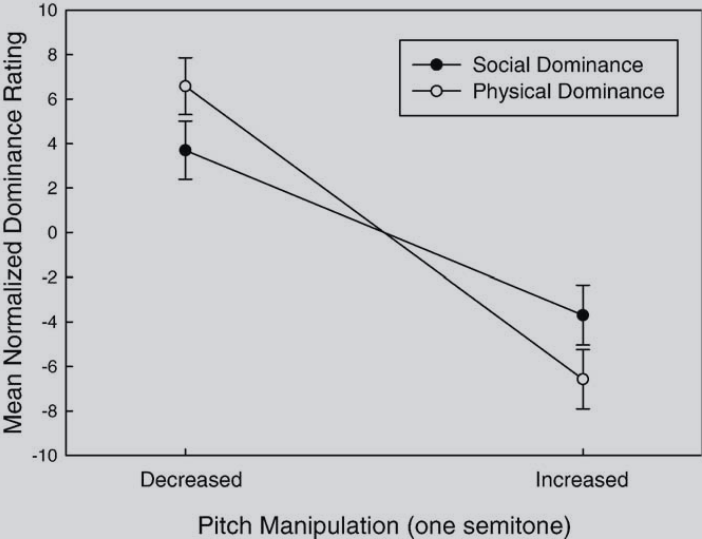
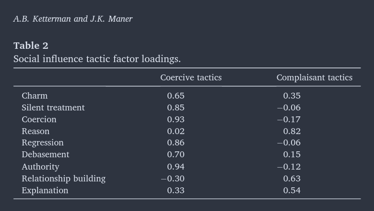

class:left, middle, bg_karl

```{r setup, include=FALSE}
options(htmltools.dir.version = FALSE)
knitr::opts_chunk$set(
  fig.width=9, fig.height=3.5, fig.retina=3,
  out.width = "100%",
  cache = FALSE,
  echo = FALSE,
  message = FALSE, 
  warning = FALSE,
  hiline = TRUE
)
```


```{r xaringan-themer, include=FALSE, warning=FALSE}
library(knitr)
library(xaringanthemer)
style_duo_accent(
  primary_color = "#b01333",
  secondary_color = "#085e9f",
  inverse_header_color = "#FFFFFF"
)
```
```{css, echo=F}
h1, h2, h3 {
  text-align: left;
}
```


```{css, echo = F}
.remark-slide-content.title-slide {
  background: linear-gradient(135deg, var(--dark) 0%, var(--primary) 60%, var(--secondary) 100%);
  color: white;
}
.remark-slide-content.title-slide h1 { color: white; font-size: 2.4em; }
.remark-slide-content.title-slide h2 { color: var(--accent); font-size: 1.5em; }
.remark-slide-content.title-slide p  { color: #D0D8F0; }

/* ── Diapositivas de sección ── */
.section-slide {
  background: var(--primary);
  color: white;
}
.section-slide h1, .section-slide h2 { color: white; }
.section-slide .subtitle { color: var(--accent); font-size: 1.2em; }

/* ── Diapositiva de cierre ── */
.closing-slide {
  background: linear-gradient(135deg, var(--dark) 0%, var(--primary) 100%);
  color: white;
}
.closing-slide h1 { color: white; }
.closing-slide p  { color: #D0D8F0; }

/* ── Cajas de contenido ── */
.definition-box {
  background: var(--light);
  border-left: 5px solid var(--primary);
  border-radius: 0 8px 8px 0;
  padding: 14px 18px;
  margin: 10px 0;
  font-size: 0.92em;
}

.highlight-box {
  background: #FFF8EC;
  border: 2px solid var(--accent);
  border-radius: 8px;
  padding: 12px 16px;
  margin: 10px 0;
  font-size: 0.92em;
}

.author-box {
  background: #EEF2F8;
  border-left: 4px solid var(--secondary);
  border-radius: 0 6px 6px 0;
  padding: 10px 14px;
  margin: 8px 0;
  font-size: 0.88em;
}

.two-col {
  display: grid;
  grid-template-columns: 1fr 1fr;
  gap: 20px;
  align-items: start;
}

.three-col {
  display: grid;
  grid-template-columns: 1fr 1fr 1fr;
  gap: 16px;
}

/* ── Tarjetas ── */
.card {
  background: white;
  border-radius: 10px;
  padding: 14px;
  box-shadow: 0 2px 8px rgba(44,62,122,0.12);
  font-size: 0.87em;
}

.card-accent {
  border-top: 4px solid var(--accent);
}

.card-primary {
  border-top: 4px solid var(--primary);
}

/* ── Etiquetas / badges ── */
.badge {
  display: inline-block;
  background: var(--primary);
  color: white;
  border-radius: 20px;
  padding: 3px 12px;
  font-size: 0.78em;
  font-weight: bold;
  margin-right: 6px;
}

.badge-accent {
  background: var(--accent);
  color: var(--dark);
}

/* ── Citas ── */
blockquote {
  border-left: 4px solid var(--accent);
  background: var(--light);
  padding: 12px 16px;
  border-radius: 0 8px 8px 0;
  font-style: italic;
  color: var(--dark);
  margin: 12px 0;
}

/* ── Numeración de pasos ── */
.step {
  display: flex;
  align-items: flex-start;
  margin-bottom: 10px;
  gap: 12px;
}
.step-num {
  background: var(--primary);
  color: white;
  border-radius: 50%;
  width: 28px;
  height: 28px;
  display: flex;
  align-items: center;
  justify-content: center;
  font-weight: bold;
  flex-shrink: 0;
  font-size: 0.9em;
}

/* ── Pie de página ── */
.footnote {
  font-size: 0.72em;
  color: var(--muted);
  border-top: 1px solid #DDD;
  padding-top: 6px;
  margin-top: 8px;
}

/* ── Tabla de contenidos ── */
.toc-item {
  padding: 10px 16px;
  margin: 7px 2;
  border-radius: 6px;
  background: rgba(255,255,255,0.12);
  color: white;
  font-size: 1.05em;
}

/* ── Misc ── */
.text-accent  { color: var(--accent); font-weight: bold; }
.text-primary { color: var(--primary); font-weight: bold; }
.text-muted   { color: var(--muted); }
.center-content { text-align: center; }

.remark-slide-number { color: var(--muted); font-size: 0.75em; }

.reduced_opacity {
  opacity: 0.3;
}

.image-container {
  display: flex;
  justify-content: left;
  align-items: left;
}

.image-container img {
  margin: 0 10px;
  height: 100px; /* Ajusta la altura según sea necesario */
}

.bg_karl {
  position: relative;
  z-index: 1;
}
.bg_karl::before {    
      content: "";
      background-image: url('https://thumbs.dreamstime.com/b/groups-people-14965088.jpg');
      background-size: cover;
      background-position:top;
      position: absolute;
      top: 0px;
      right: 0px;
      bottom: -10px;
      left: 0px;
      opacity: 0.3;
      z-index: -1;
}

#penn-logo {
  width: 330px; /* Adjust the width as needed */
  height: auto; /* Maintain the aspect ratio */
}

#faro-logo {
  width: 400px; /* Adjust the width as needed */
  height: auto; /* Maintain the aspect ratio */
}

```

## Curso Psicología de los Grupos
### Clase 3: Roles, estatus y normas sociales

<br>


<left><strong>Francisco Villarroel-Riquelme (CICS, UDD)</strong></left>


   [fvillarroelr@udd.cl](mailto:fvillarroelr@udd.cl)


<br>

```{r, echo=FALSE, fig.align='center', out.width="20%"}


knitr::include_graphics("clase3_files/logo_psicologia_UDD.png")
```

---
class: inverse, middle

# Agenda de hoy

- Repaso: Tipos de grupo
- Estatus
- Roles
- Normas


---

```{r, out.width="50%", fig.align='center'}

```

---

## ¿Cómo se genera la estructura grupal?

.two-col[
.card.card-primary[
**Fuentes de la estructura**

<div class="step"><div class="step-num">1</div><div><strong>Interacción continua</strong> entre los miembros a lo largo del tiempo</div></div>
<div class="step"><div class="step-num">2</div><div><strong>Tareas grupales</strong> determinadas por los objetivos del grupo</div></div>
<div class="step"><div class="step-num">3</div><div><strong>Características individuales</strong> de los miembros</div></div>
<div class="step"><div class="step-num">4</div><div><strong>Variables ambientales</strong> — entorno físico y social</div></div>
]

.highlight-box[
> "La interacción no es la suma de las partes, sino integradora y creadora de nuevas pautas de comportamiento, pautas de acción que van más allá del efecto directo de un sujeto sobre otro y que dependen del sistema que engloba esas interacciones."
> <br>— Turner (1994, p. 30)

**Elementos estructurales manifiestos:** tamaño, lugar, etc.

**Elementos estructurales implícitos:** redes afectivas, normas, valores, estatus.
]
]

---

# Una mirada integradora

.highlight-box[
> "La estructura del grupo debe mirarse desde la circularidad que ha de presidir toda relación grupal, más que en torno a una relación de causa y efecto. La interacción repetida de los miembros genera cambios de posición **(estatus)**, prescripciones de comportamiento **(normas)** que dan lugar a funciones diferenciales **(roles)** que cristalizan una estructura de poder en cuyo vértice está el líder y acceso diferencial a los canales de comunicación, que terminan generando la aparición de la cultura grupal."
> <br>— Roda (1999)
]

.three-col[
.card.card-accent[
**Estatus**  
Cambios de posición dentro del grupo
]
.card.card-accent[
**Normas**  
Prescripciones de comportamiento
]
.card.card-accent[
**Roles**  
Funciones diferenciales
]
]

---
class: inverse, middle

## Estatus
### Posición, expectativas y jerarquía

---

## Definición de estatus

.two-col[
.definition-box[
**El estatus** es la posición social que la persona ocupa en el grupo.

El **poder** puede interpretarse como la capacidad o habilidad para ejercer influencia; y la **influencia** es poder en acción.

**Estatus alude a la posición** que se ocupa en el grupo, mientras que los **roles describen el comportamiento** de la persona que ocupa esa posición.
]

.author-box[
**Parsons (1969)**

El estatus no es una característica del individuo, sino del **sistema social**. El proceso social es anterior al sujeto y se encuentra regulado por ciertas normas y valores que en lo fundamental no son voluntarios, sino impuestos.

→ Otorga un lugar *secundario* a las características individuales.
]
]

---

## Teoría de los Estados de Expectativas (TEE)

.two-col[
.card.card-primary[
**¿Cómo emerge la jerarquía de estatus?**

Berger et al. (1974, 1980): la base principal del estatus son las **expectativas de desempeño** que tienen los miembros sobre cuál será la contribución de cada uno a la tarea grupal.

**Dos condiciones marco:**
- *Orientación colectiva* — es legítimo considerar las contribuciones de los demás
- *Orientación a la tarea* — motivados a solucionar un problema

Solo aplica a grupos focalizados en el desempeño *(jurado, equipo deportivo)*, no a grupos informales *(amigos a cenar)*.
]

.card.card-accent[
**Antecedentes de las expectativas de desempeño**

<div class="step"><div class="step-num">1</div><div><strong>Características de estatus</strong> — atributos valorados socialmente en relación a la competencia (género, conocimientos, etc.)<br>• <strong>Difusas:</strong> expectativas generales (género, raza)<br>• <strong>Específicas:</strong> directamente ligadas a la tarea</div></div>

<div class="step"><div class="step-num">2</div><div><strong>Recompensas sociales</strong> — distribución desigual → los miembros infieren estatus</div></div>

<div class="step"><div class="step-num">3</div><div><strong>Patrones de intercambio conductual</strong> — conductas de alto estatus respondidas con conductas de bajo estatus → "tipificaciones de estatus"</div></div>
]
]

---

## Las expectativas como profecía autocumplida

.highlight-box[
Cuanto más altas sean las **expectativas de desempeño** sobre un individuo respecto a otro, más oportunidades se le darán al primero para:

- Aportar sugerencias
- Contribuir a las metas del grupo
- Recibir evaluaciones más positivas de sus contribuciones
- Ejercer más influencia
- Aceptar menos la influencia de los otros

→ Las expectativas de desempeño crean y mantienen una **jerarquía de participación, evaluación e influencia**.
]

.footnote[Berger, Rosenholtz y Zelditch (1980)]

---

## Vías de adquisición del estatus

.two-col[
.card.card-primary[
## Dominancia

Imposición de miedo a los pares para alcanzar o mantener influencia *(Cheng & Tracy, 2014)*.

Los individuos dominantes mantienen su posición inculcando miedo en quienes se encuentran más abajo en la jerarquía.

Se asocia a: narcisismo, manipulación y hostilidad.

*Ejemplo: relación entre jefe y subordinados de carácter coercitivo.*
]

.card.card-accent[
## Prestigio

"Respeto y aprobación otorgada a unos por otros" *(Barkow et al., 1975, p. 29)*.

Se relaciona con alta autoestima y amabilidad *(Cheng et al., 2010)*.

Impacta en la competencia intrasexual y el éxito reproductivo tanto en hombres como en mujeres.

*Ejemplo: reconocimiento por competencia y logros.*
]
]

.footnote[Perspectiva etológica: los miembros evalúan características físicas (vigor, altura, expresión facial) como indicadores de dominancia social.]

---
```{r, out.width="60%", fig.align='center'}

```
---

```{r}

```

---

## Origen del estatus

.two-col[
.card.card-primary[

### Estatus **adscrito**

Se determina por nacer en una familia dada, por tener cierta edad, por pertenecer a un género.

→ Es otorgado, no ganado.

*Ejemplos: herencia, título nobiliario, género asignado.*
]

.card.card-accent[
### Estatus **adquirido**

La persona lo obtiene por medio del estudio, el esfuerzo y la motivación.

→ Se gana a través del **prestigio**.

*Ejemplos: titulación académica, ascenso laboral por mérito, reconocimiento profesional.*
]
]

<br>

.author-box[
**Teoría de la Identidad Social y estatus:** En grupos de *bajo estatus* con límites flexibles → bajo nivel de identificación. Cuando el estatus del grupo es *alto* → mayor nivel de compromiso.
]

---
class: inverse, middle

## Roles
### Definición, diferenciación y conflicto

---
## ¿Qué es un rol?

.two-col[
.definition-box[
**Del latín *rotulus*:** así se designaban en la antigüedad los rollos de pergamino en los que se escribían los papeles o intervenciones de los actores.

Un rol hace referencia a nuestros distintos **papeles** sociales.

**Definición:** el comportamiento de la persona que ocupa una posición en el grupo, lo cual implica una serie de **derechos y deberes** hacia uno o más miembros *(Hare, 1994; Linton, 1936)*.

> El **estatus** es el elemento básico de los grupos organizados, mientras que los **roles** se refieren a la conducta propia de los que ocupan esa posición *(Newcomb, 1950)*.
]

.card.card-accent[
**Tipos de roles según su carácter**

 **Formales** — definición clara y precisa de funciones; asignados explícitamente  
*Ej.: roles en un equipo de producción, equipo deportivo, grupo musical.*

 **Informales** — no se asignan específicamente; surgen y se definen a través de la interacción  
*Ej.: líder no oficial que dirige las actividades sociales del grupo.*

<br>

**Reflexión:** ¿Cuántos roles tienes/cumples tú?
]
]

---

## Diferenciación de roles

.three-col[
.card.card-primary[
###  Roles de tarea

Específicos y acotados a los objetivos del grupo.

*Ej.: profesor, estudiante, coordinador.*

Coordinan y facilitan las actividades de solución de problemas.

→ Relacionados con el **logro de metas grupales**.
]

.card.card-accent[
###  Roles socioemocionales

Relacionados con la cohesión grupal y las relaciones entre sus miembros.

*Ej.: conciliador, armonizador.*

Apoyan y regulan las actitudes orientadas al grupo.

→ Relacionados con el **mantenimiento del grupo**.
]

.card.card-primary[
###  Roles individuales

Relacionados con la satisfacción de necesidades personales irrelevantes o perturbadoras para el grupo.

*Ej.: agresor del curso.*

Potencialmente **disfuncionales** porque no se dirigen ni a la tarea ni al mantenimiento del grupo.
]
]

.footnote[Clasificación de Benne y Sheats (1948); evidencia empírica: Mudrack y Farrell (1995)]

---

## Evidencia empírica: Bales y Slater (1955)

.two-col[
.card.card-primary[
**Diferenciación observada**

Usando el Método de Observación Sistemática (MOB), Bales y Slater demostraron que en grupos de tarea emergen dos tipos de roles diferenciados:

 **Líder orientado a la tarea:** persona más activa, que aporta las mejores ideas y guía la discusión.

 **Líder socioemocional:** persona que cae mejor, reduce tensiones entre miembros y se ocupa del mantenimiento del grupo.
]

.author-box[
**Parsons y Bales (1953)** identificaron cuatro dimensiones básicas de los roles:

| Dimensión | Descripción |
|-----------|-------------|
| **Logro de metas (M)** | Orientación al resultado |
| **Expresiva (E)** | Orientación emocional |
| **Adaptativa (A)** | Flexibilidad y ajuste |
| **Integrativa (I)** | Cohesión del sistema |

→ **Conductas instrumentales** (M+A) y **conductas socioemocionales** (E+I).
]
]

---

## Dos dimensiones del rol

.two-col[
.card.card-primary[

### Dimensión situacional

Los roles tienen asociadas distintas expectativas vinculadas a una determinada posición.

- Independencia del sujeto
- Conducta *esperada* como componente clave
- Concepción pasiva del sujeto
- Alude a la representación dramática del rol

**Homo sociologicus** *(Dahrendorf, 1975)*: el individuo ES sus papeles sociales; son algo "dado" a su portador, pautas de comportamiento que deben ser aprendidas. La no realización tiene una *sanción social*.
]

.card.card-accent[
##  Dimensión personal

Se subrayan las características personales en el desempeño del rol.

- Los roles quedan supeditados a las actitudes o predisposiciones permanentes para actuar de determinada manera
- Desde el psicoanálisis: repetimos los roles aprendidos en nuestras primeras etapas de vida

→ El contenido del rol lo *define la sociedad*, pero la *persona* lo interpreta y ejecuta.
]
]

---
class: left, middle


## Normas sociales

>Reglas informales públicas y compartidas que orientan el comportamiento humano (Bicchieri, 2005).

Sostenidas en:

1. **Contingencia:** ("Tal norma funciona para $X$ situaciones")
2. **Expectativa empírica:** Creencia de que la mayoría de las personas se comportará de $y$ forma
3. **Expectativa normativa:** La creencia de que hay una cantidad de personas que se comportará de cierta forma en situaciones determinada, o que habrá una sanción si no se comportan de esta manera (Bicchieri, 2005, 2017; Bicchieri et.al., 2023; Bicchieri & Xiao, 2009).


---
class: left, middle


## Utilidad y normas sociales


$$U(a_k) = V(\pi(a_k)) + \gamma N(a_k)$$


* $k$ = Conjunto de acciones posibles para un contexto determinado

* $V$ = El valor que entrega una acción
* $\pi (a_k)$ = Acción tomada
* $N(a_k) \in [-1, -1]$ = Juicio colectivo medible sobre el nivel de lo apropiado o inapropiado
* $\gamma \geq 0$ = Al individuo le importa adherirse a las normas sociales
* $ A = \{a_1, ..., a_k\}$ = Rango de acciones posibles para una situación determinada

---
class: center, middle


|                          |               Comportamiento independiente         |                     Comportamiento interdependiente       |
|--------------------------|----------------------------------------------------|-----------------------------------------------------------|
| **Descriptivo**              |  <center><strong>Costumbre</center></strong>                                         |    <center><strong>Norma descriptiva</center></strong>                                     |
|                          | <center>(_"Hago x porque satisface mis necesidades"_)</center>       |   <center>(_"Hago x tu esperas que otros hagan x"_)</center>                 |
| **Mandatorio**               |  <center><strong>Regla moral</center></strong>                                       |     <center><strong>Norma social</center></strong>                                          |                               
|                          | <center>_("Prefiero hacer x porque es lo correcto de hacer"_)</center>  |     <center>_("Prefiero hacer x porque espero que los otros lo hagan y deberían hacerlo)_</center> |


