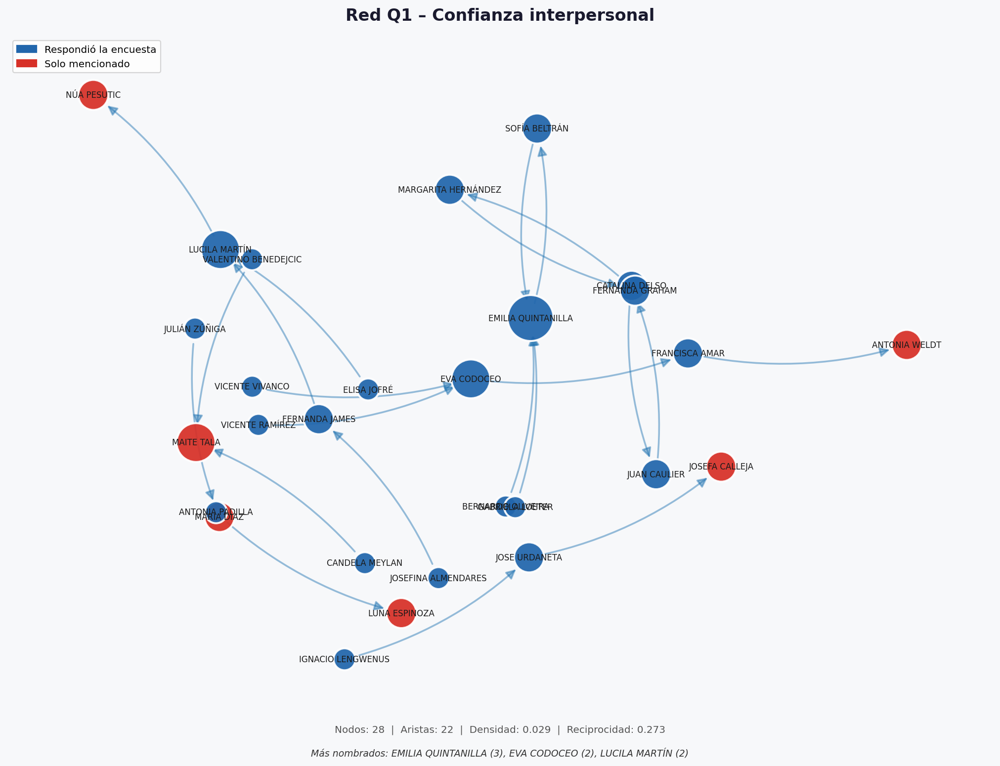
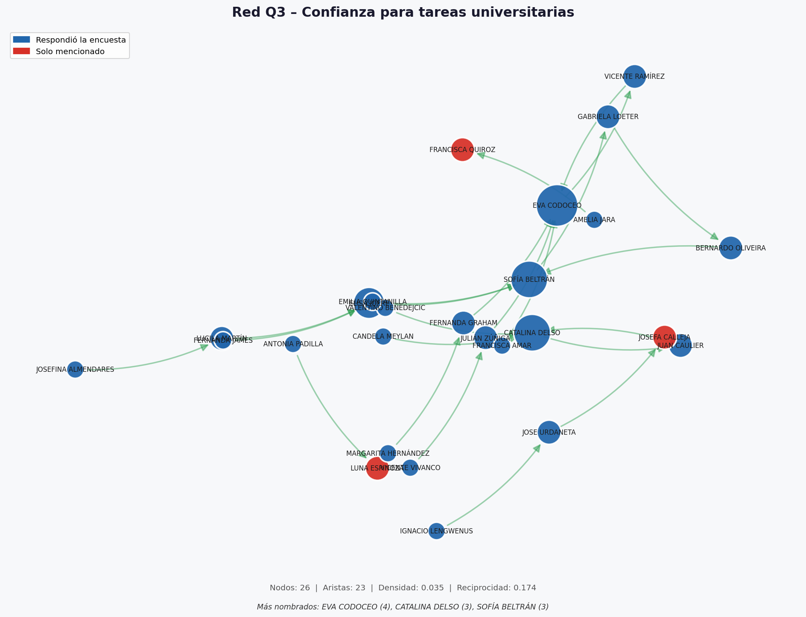
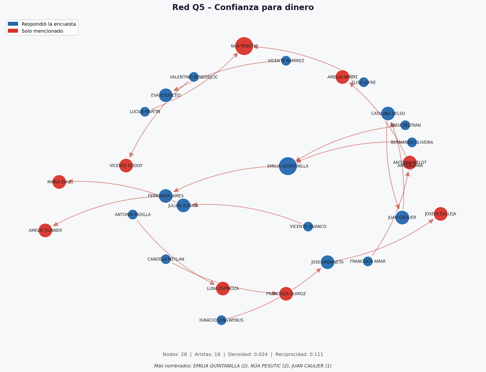
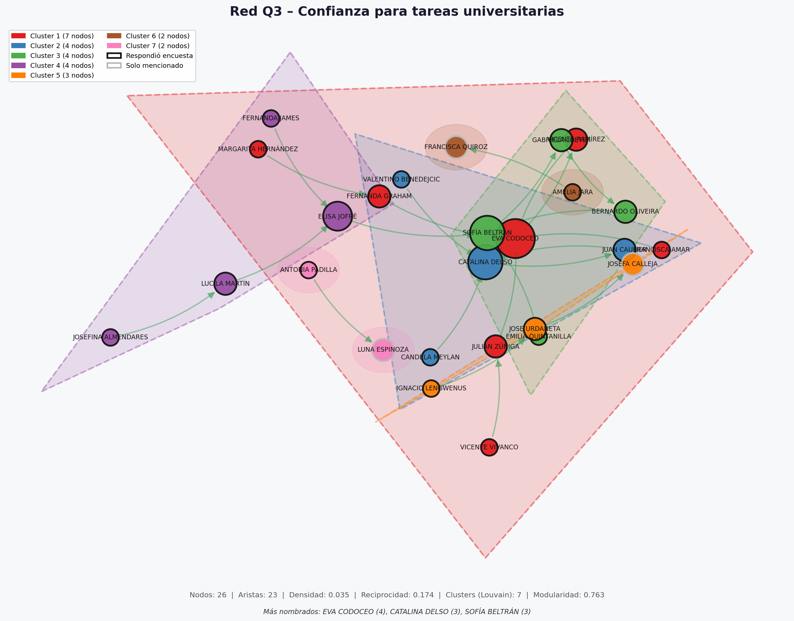
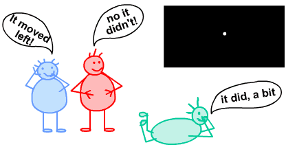
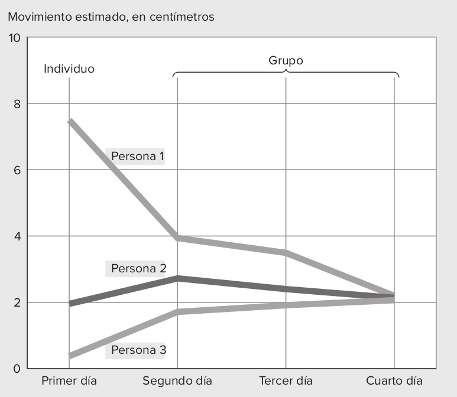
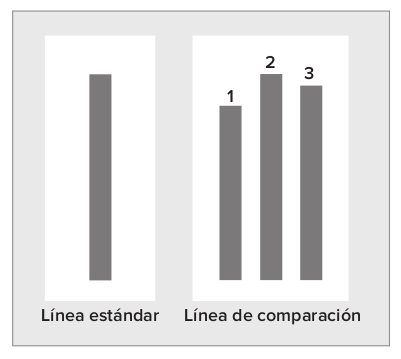
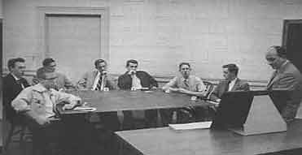
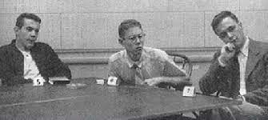

class: left, middle, bg_teorias

```{r setup, include=FALSE}
options(htmltools.dir.version = FALSE)
knitr::opts_chunk$set(
  fig.width=9, fig.height=3.5, fig.retina=3,
  out.width = "100%",
  cache = FALSE,
  echo = FALSE,
  message = FALSE, 
  warning = FALSE,
  hiline = TRUE
)
```

```{r xaringan-themer, include=FALSE, warning=FALSE}
library(knitr)
library(xaringanthemer)
style_duo_accent(
  primary_color = "#b01333",
  secondary_color = "#085e9f",
  inverse_header_color = "#FFFFFF"
)
```

```{css, echo=F}
h1, h2, h3 {
  text-align: left;
}
```

```{css, echo=F}
/* ── Title & section slides ── */
.remark-slide-content.title-slide {
  background: linear-gradient(135deg, var(--dark) 0%, var(--primary) 60%, var(--secondary) 100%);
  color: white;
}
.remark-slide-content.title-slide h1 { color: white; font-size: 2.2em; }
.remark-slide-content.title-slide h2 { color: var(--accent); font-size: 1.4em; }
.remark-slide-content.title-slide p  { color: #D0D8F0; }

.section-slide { background: var(--primary); color: white; }
.section-slide h1, .section-slide h2 { color: white; }
.section-slide .subtitle { color: var(--accent); font-size: 1.2em; }

.closing-slide {
  background: linear-gradient(135deg, var(--dark) 0%, var(--primary) 100%);
  color: white;
}
.closing-slide h1 { color: white; }
.closing-slide p  { color: #D0D8F0; }

/* ── Content boxes ── */
.definition-box {
  background: var(--light);
  border-left: 5px solid var(--primary);
  border-radius: 0 8px 8px 0;
  padding: 14px 18px;
  margin: 10px 0;
  font-size: 0.91em;
}
.highlight-box {
  background: #FFF8EC;
  border: 2px solid var(--accent);
  border-radius: 8px;
  padding: 12px 16px;
  margin: 12px 0;
  font-size: 0.81em;
}
.activity-box {
  background: #fff3cd;
  border-left: 5px solid #ffc107;
  border-radius: 0 8px 8px 0;
  padding: 14px 18px;
  margin: 10px 0;
  font-size: 0.89em;
}
.author-box {
  background: #EEF2F8;
  border-left: 4px solid var(--secondary);
  border-radius: 0 6px 6px 0;
  padding: 10px 14px;
  margin: 8px 0;
  font-size: 0.87em;
}
.source-box {
  background: #f0f4ff;
  border-left: 4px solid var(--secondary);
  border-radius: 0 6px 6px 0;
  padding: 8px 14px;
  margin: 8px 0;
  font-size: 0.80em;
  color: #444;
}

/* ── Layouts ── */
.two-col {
  display: grid;
  grid-template-columns: 1fr 1fr;
  gap: 20px;
  align-items: start;
}
.three-col {
  display: grid;
  grid-template-columns: 1fr 1fr 1fr;
  gap: 16px;
}

/* ── Cards ── */
.card {
  background: white;
  border-radius: 10px;
  padding: 14px;
  box-shadow: 0 2px 8px rgba(44,62,122,0.12);
  font-size: 0.86em;
}
.card-accent  { border-top: 4px solid var(--accent); }
.card-primary { border-top: 4px solid var(--primary); }
.card-blue    { border-top: 4px solid var(--secondary); }

/* ── Badges ── */
.badge {
  display: inline-block;
  background: var(--primary);
  color: white;
  border-radius: 20px;
  padding: 3px 12px;
  font-size: 0.78em;
  font-weight: bold;
  margin-right: 6px;
}
.badge-accent { background: var(--accent); color: var(--dark); }
.badge-blue   { background: var(--secondary); color: white; }

/* ── Quotes ── */
blockquote {
  border-left: 4px solid var(--accent);
  background: var(--light);
  padding: 12px 16px;
  border-radius: 0 8px 8px 0;
  font-style: italic;
  color: var(--dark);
  margin: 12px 0;
}

/* ── Steps ── */
.step {
  display: flex;
  align-items: flex-start;
  margin-bottom: 10px;
  gap: 12px;
  align-items: left;
}
.step-num {
  background: var(--primary);
  color: white;
  border-radius: 50%;
  width: 28px; height: 28px;
  display: flex;
  align-items: center;
  justify-content: center;
  font-weight: bold;
  flex-shrink: 0;
  font-size: 0.9em;
}

/* ── Misc ── */
.footnote {
  font-size: 0.72em;
  color: var(--muted);
  border-top: 1px solid #DDD;
  padding-top: 6px;
  margin-top: 8px;
}
.toc-item {
  padding: 10px 16px;
  margin: 7px 0;
  border-radius: 6px;
  background: rgba(255,255,255,0.12);
  color: white;
  font-size: 1.0em;
}
.text-accent  { color: var(--accent); font-weight: bold; }
.text-primary { color: var(--primary); font-weight: bold; }
.text-muted   { color: var(--muted); }
.remark-slide-number { color: var(--muted); font-size: 0.75em; }
.reduced_opacity { opacity: 0.3; }
.timer-box {
  display: inline-block;
  background: var(--primary);
  color: white;
  border-radius: 6px;
  padding: 3px 14px;
  font-size: 0.82em;
  font-weight: bold;
  margin-bottom: 8px;
}
.big-number {
  font-size: 2.8em;
  font-weight: 900;
  color: var(--primary);
  line-height: 1;
}

/* ── Background portada ── */
.bg_teorias {
  position: relative;
  z-index: 1;
}
.bg_teorias::before {
  content: "";
  background-image: url('https://thumbs.dreamstime.com/b/groups-people-14965088.jpg');
  background-size: cover;
  background-position: center;
  position: absolute;
  top: 0px; right: 0px; bottom: -10px; left: 0px;
  opacity: 0.22;
  z-index: -1;
}

/* ── Tables ── */
table { font-size: 0.80em; width: 100%; border-collapse: collapse; }
th { background: var(--primary); color: white; padding: 7px 10px; text-align: left; }
td { padding: 6px 10px; border-bottom: 1px solid #e0e0e0; }
tr:nth-child(even) { background: #f5f7fa; }
```

---
class: left, middle, bg_teorias

# Perspectivas Teóricas y Metodológicas en Psicología de los Grupos

## Psicología Social de los Grupos — Clase 2


**Francisco Villarroel Riquelme** | `r Sys.Date()`


---

# ¿Qué veremos hoy?

- Principales teorías sobre los grupos
- Énfasis en cognitivo


---
class: middle, left


## Actividad de entrada

.activity-box[
**Instrucción:** Piensa en dos grupos a los que hayas pertenecido:
- Uno que haya **funcionado muy bien**
- Uno que haya sido **complicado o disfuncional**

.step[.step-num[1] ¿Qué hacía que el primero funcionara?]
.step[.step-num[2] ¿Qué rompía la dinámica del segundo?]
.step[.step-num[3] ¿Era algo de las *personas* o de la *situación*?]
]


---
class: inverse, middle

## 1. La Sociometría

## Jacob Levy Moreno (1889–1974)

---

## Moreno — Contexto y motivación

.two-col[
.author-box[
**Jakob Levy Moreno (1889–1974)**

Rumano, origen judío sefardita  
Estudió Medicina y Psiquiatría en Viena  
Discípulo de Freud  
Emigró a EE.UU. en los años 30

📚 *Who shall survive?* (1934)
]

.highlight-box[
**Motivación central:**

**El mundo va hacia una catástrofe**, pero podemos salvarnos si el ser humano recuperaba la **espontaneidad y la creatividad**.

La Sociometría era su herramienta de transformación social.
]
]

---

## Moreno — Conceptos básicos

.three-col[
.card.card-primary[
**Átomo social**

Elemento básico de la estructura microsociológica.

Cada individuo, con su posición (rol, estatus) y su red de relaciones, *constituye* un átomo social.
]

.card.card-blue[
**Tele**

Relación socioafectiva entre átomos sociales:

- **Tele positivo** → atracción
- **Tele negativo** → rechazo

Solo se establece cuando la atracción o rechazo son *recíprocos*.
]

.card.card-accent[
**Ley sociodinámica**

Gobierna el conjunto de relaciones *tele* de un grupo. Explica estrellas, aislados, cadenas.

**No es universal:** varía de grupo en grupo y debe descubrirse en cada caso.
]
]

--

<br>

.highlight-box[
**Ley de gravitación social:** Integra todas las leyes sociodinámicas. La necesidad de ubicar a cada miembro en una posición es *universal*; los criterios de esa ubicación varían entre grupos.
]

---

## Las Técnicas Sociométricas

.two-col[
.card.card-primary[
**Sociometría Descriptiva**

Medir y evaluar estructuras sociales (redes afectivas, estatus, liderazgo).

**Test sociométrico:** cada miembro anota preferencias y rechazos hacia otros según distintos criterios.

Tres tipos de preguntas:
1. Solo **tarea** ("¿a quién le pasarías el balón?")
2. **Tarea + afecto** ("¿con quién en el autobús?")
3. Solo **afecto** ("¿a quién te gustaría encontrarte el sábado?")
]

.card.card-blue[
**Sociometría Dinámica**

Intervenir en las estructuras para transformarlas.

**Psicodrama:** dramatización de los problemas grupales. Efecto *catártico*: libera tensiones latentes y facilita su resolución.

Origen de todas las técnicas modernas de *role-playing* (intercambio de roles, dobles, espejo...).
]
]

---

## El Sociograma — Posiciones clave

.highlight-box[
El sociograma representa a los miembros con figuras geométricas unidas por flechas que indican teles positivos (elecciones) o negativos (rechazos). Permite leer la **estructura socioafectiva** del grupo de un vistazo.
]

| Posición | Descripción |
|---|---|
| ⭐ **Estrella / Líder afectivo** | La más elegida; posición central |
| 👻 **Olvidado** | Elige a otros pero nadie la elige |
| 🏝️ **Isla / Aislado** | Ni elige ni es elegido — caso de Adriana en el ejemplo del libro |
| 🤝 **Pareja** | Dos miembros que se eligen mutuamente |
| 🌫️ **Eminencia gris** | Sin popularidad, pero gran influencia sobre el líder |
| ➡️ **Cadena** | A→B→C: elecciones en secuencia lineal |

.footnote[Índices individuales: aceptación, rechazo, sociabilidad. Índice grupal: cohesión (próxima clase). Muñoz García (2003, pp. 49–50).]

---
class: inverse, middle, center


## Otra forma de ver la estructura grupal: Redes


---


```{r, out.width="80%", fig.align='center'}

```

---

```{r, out.width="80%", fig.align='center'}

```


---


```{r, out.width="80%", fig.align='center'}

```

---

```{r, out.width="80%", fig.align='center'}

```

---
class: inverse, middle

# 2. La Teoría del Campo

## Kurt Lewin (1890–1947)

---

## Lewin — Contexto

.two-col[
.author-box[
**Kurt Lewin (1890–1947)**

Psicólogo alemán, origen judío  
Figura central de la **Gestalt**  
Obligado a salir de Europa en los años 30  
Obra en EE.UU. hasta su muerte a los 56 años

📚 *Field Theory in Social Science* (1951)
]

.definition-box[
**Origen y ampliación de la teoría:**

Lewin crea la Teoría del Campo para explicar el comportamiento *individual*. A partir de la lectura de Moreno, la amplía a la **dinámica grupal y social**.

> El grupo, al igual que el individuo, es un **"campo de fuerzas"**: vectores de distinta naturaleza e intensidad que se influyen mutuamente.

Inspirado en la **Topología** matemática: conjuntos, vectores, superficies.
]
]

---

## Lewin — Conceptos clave

.three-col[
.card.card-primary[
**Yo social**

La personalidad tiene capas:  
yo íntimo → **yo social** (normas y valores compartidos con el grupo) → yo público.

*Somos, en buena medida, producto de nuestras relaciones grupales.*
]

.card.card-blue[
**Totalidad dinámica**

Conjunto de elementos en **interdependencia mutua**: un cambio en una parte afecta a las demás. El todo ≠ suma de las partes.

Cuando la totalidad es social → **campo social**.
]

.card.card-accent[
**🗺️ Espacio vital**

Campo de fuerzas que rodea al individuo y al grupo. Los grupos son parte básica de ese espacio: orientan conductas, actitudes y modos de pensar.
]
]

--

<br>

.highlight-box[
**Fórmula:** C = f(P, E) — La conducta es función de la persona *y* del entorno tal como son *percibidos*. No hay conducta sin campo.
]

---

## Lewin — Implicaciones metodológicas

.step[.step-num[1] **Estudio del campo completo:** El grupo tiene fuerzas internas (cohesión, comunicación, liderazgo) *y* externas (contexto organizacional, relaciones intergrupales). Ambas deben estudiarse.]

.step[.step-num[2] **Multidisciplinariedad:** La complejidad del grupo exige integrar distintas ciencias sociales. Origen de los equipos multiprofesionales y las titulaciones interdisciplinares.]

.step[.step-num[3] **Investigación-Acción** *(action-research)*: Combinación de participación activa y rigor científico. Interacción continua entre teoría y aplicación práctica.]

--

<br>

.definition-box[
**Grupos-testigo:** Lewin propone usar subgrupos o individuos como focos de "irradiación e influencia" que provoquen cambios en el campo grupal. Ej.: docentes, líderes comunitarios, asociaciones vecinales actúan como *agentes de cambio social*.
]

---
class: inverse, middle

# 3. El Psicoanálisis Grupal

## Wilfred Bion (1897–1979)

---

## Bion — Contexto y tesis central

.two-col[
.author-box[
**Wilfred R. Bion (1897–1979)**

Psiquiatra británico  
Instituto Tavistock de Londres  
Clínica y selección de mandos militares  
Perspectiva **psicodinámica**

📚 *Experiencias en grupos* (1952/1980)
]

.definition-box[
**Dos planos simultáneos en todo grupo:**

| Plano | Nombre | Vínculo |
|---|---|---|
| **Racional/consciente** | Grupo de trabajo | Cooperación hacia la tarea |
| **Emocional/inconsciente** | Supuestos básicos | *Valencia*: energía emocional instantánea e instintiva |

La *valencia* es análoga a la libido freudiana, pero más neutra y colectiva.
]
]

---

## Los Tres Supuestos Básicos

El grupo pasa de uno a otro **sin orden fijo**, según su historia particular y las circunstancias de cada momento.

.three-col[
.card.card-primary[
**Dependencia (SB-D)**

El grupo idealiza al líder como única fuente de protección y soluciones. Tiende a rechazar toda aportación que no provenga de él.

*Típico en las primeras fases de formación del grupo.*
]

.card.card-accent[
**⚔️ Lucha-Huida (SB-LH)**

El grupo funciona bajo la creencia de que debe luchar o huir de un enemigo — real o imaginario — dentro o fuera del grupo.

Dominan hostilidades, rebeldía, facciones y enfrentamientos.
]

.card.card-blue[
**Apareamiento (SB-A)**

Sentimientos de esperanza, afecto e intimidad dominan. El grupo aguarda que una pareja genere una solución o líder mesiánico.

La esperanza debe permanecer *futura*: si se concreta, el encanto se rompe.
]
]

.footnote[Muñoz García (2003, p. 56): los SB coexisten con la tarea, unas veces obstaculizándola, otras facilitándola.]

---

## Bion — Operacionalización: Thelen y Stock

.author-box[**H.A. Thelen & D. Stock (fines de los 50)** · Integración ecléctica de Bion con metodología experimental]

**Sistema de Valoración Conductual:** permite observar y categorizar conductas individuales para analizar la dinámica grupal.

.two-col[
.card.card-primary[
**Categorías emocionales**

- *Dependencia:* búsqueda de aprobación del líder
- *Apareamiento:* afecto, cordialidad, entusiasmo
- *Lucha:* ataques, amenazas, burlas
- *Huida:* respuestas evasivas, expresiones de temor
]

.card.card-blue[
**Categorías de trabajo**

- *Cat. I:* orientada a intereses personales
- *Cat. II:* implicación en las tareas del grupo
- *Cat. III:* como II, introduciendo innovaciones
- *Cat. IV:* como II, integrando ideas o experiencias ajenas
]
]

---
class: inverse, middle

## 4. La Cognición Social

### Psicología Social cognitiva norteamericana

.subtitle[Sherif · Asch · Festinger]

---

## Sherif — Normas sociales y percepción grupal

.author-box[**Muzafer Sherif (1906–1988)** · Turco de origen · Perseguido político · Formado en EE.UU.]

.definition-box[
Para Sherif, la interacción grupal convierte al grupo en una **Gestalt**: sistema funcional con normas, valores y objetivos que influyen en el comportamiento individual, llevando a los miembros a buscar **convergencia normativa** (marcos de referencia compartidos), interiorizándolos más allá de la situación grupal.
]

.two-col[
.card.card-primary[
**Efecto autocinético (1936)**

En oscuridad, un punto de luz fijo parece moverse. En soledad, cada sujeto forma su propio marco. En grupo, los juicios **convergen** hacia una norma que **persiste** cuando el sujeto está solo.

→ Las normas grupales guían la percepción de la realidad.
]

.card.card-blue[
**🏕️ La Cueva de los Ladrones (1954)**

Campamento con niños: formación espontánea de grupos → conflicto intergrupal → reducción del conflicto mediante **metas supraordinadas**.

→ Pionero en el estudio de relaciones intergrupales.
]
]
---
class: middle, left

### Teoría del conflicto realista


.highlight-box[ *El marco de referencia apropiado para el estudio de la conducta intergrupal es el de las relaciones funcionales entre dos o más grupos*
*y los productos de esas relaciones que pueden ser positivos o negativos”* (Sherif y Sherif, 1979, p. 9)]

<br> 

#### Elementos centrales

.three-col[

.card.card-primary[

Relación funcional inteergrupal se ven afectados por la convergencia o divergencia de metas

ej: Amenaza real o imaginada de la seguridad de un grupo

]

.card.card-primary[

Cooperación o competición es su mecanismo interdependiente. El conflicto nace por metas incompatibles

]

.card.card-primary[

A mayor competición por recursos limitados, más intensas serán las diversas
conductas que indican el rechazo intergrupal, como el prejuicio, la discriminación y la hostilidad

]
]

---

¿Se puede recrear el nacimiento de una norma social en el laboratorio?

--

.pull-left[

```{r, echo=FALSE, fig.align='center'}

```

]

--

.pull-right[

* Se coloca una persona enun cuarto oscuro, sin referencia espacial
* Se lanza una luz a 4.5mts que se mueve erráticamente. Se le pregunta a la persona cuánto se movió la luz
* Primero 15cm, luego 25cm y las posteriore sseñala que son 20cm
* Se integran a dos personas más que dicen números bastante menores (2.5 y 5cm). Con el pasar de los intentos las personas convergen en un número.

]

---

## Asch — Conformismo y presión de la mayoría

.author-box[**Solomon E. Asch (1907–1996)** · Varsovia → Nueva York · Influido por la Gestalt a través de Wertheimer]

.two-col[
.definition-box[
**Enfoque interaccionista:**

Los miembros inciden en el grupo *y* el grupo incide en los miembros. Las influencias en ambas direcciones son **inseparables** y conforman un sistema psicosocial único.

Este enfoque es considerado una alternativa vigente a los extremos individualista y colectivista.
]

.card.card-primary[
**Experimentos de conformismo (1951–1956)**

Sujeto rodeado de cómplices que dan respuestas **obviamente incorrectas** sobre longitud de líneas.

.big-number[~37%]

de las respuestas seguían al grupo equivocado.

Un solo **disidente** reducía drásticamente la conformidad.
]
]
---
background-image:url(clase4_files/logo_psicologia_UDD.png)
background-size: 200px
background-position: 5% 95%
class: left, middle


.pull-left[

```{r, echo=FALSE, fig.align='center'}

```


]

--

.pull-right[

* Finalmente, la luz **nunca se movió. se usa una ilusión óptica**
* Sheriff quería mostrar la capacidad de sugestión de las personas
* Se les preguntó a las mismas personas un año después y las personas seguían acatando la norma grupal

]

---
background-image:url(clase4_files/logo_psicologia_UDD.png)
background-size: 200px
background-position: 95% 5%

## Experimento de Solomon Asch


.pull-left[

* Se les invita a un grupo de estudiantes a una investigación sobre percepciones
* Sólo uno de ellos es un participante genuino. los demás son cómplices
* Se les muestra una línea estandar y otro grupo de tres líneas. se pide señalar cuál es la línea del segundo grupo que mejor se ajusta a la línea estándar
* Todos los cómplices dan una respuesta deliberadamente errónea

]


.pull-right[

```{r, echo=FALSE, fig.align='center'}



```
]

---
background-image:url(clase4_files/logo_psicologia_UDD.png)
background-size: 200px
background-position: 95% 5%

```{r, echo=FALSE, fig.align='center', out.width="55%", fig.cap="experimento de solomon ash"}





```

---
## Festinger — Comparación Social y Disonancia

.author-box[**Leon Festinger (1919–1989)** · Nueva York · Discípulo y doctorando de Kurt Lewin]

.two-col[
.card.card-blue[
**Contribuciones grupales directas**

- Estudio de comunicaciones informales en grupos (presiones hacia la convergencia)
- Definición operacional de la **cohesión grupal** (vigente por décadas)
- Trabajos sobre **desindividuación** (retomando a Le Bon)

📚 *Teoría de la Comparación Social* (1954)
]

.card.card-accent[
**Disonancia Cognitiva (1957)**

Cogniciones inconsistentes → tensión → necesidad de reducirla:
- Cambio de actitud
- Racionalización
- Búsqueda de confirmación

En grupos cohesivos: riesgo de **groupthink** (Janis, 1972) — el grupo prioriza el consenso sobre el análisis crítico.
]
]

---
class: inverse, middle

## 5. El Sociocognitivismo Europeo

## Moscovici · Tajfel · Turner

.subtitle[A partir de los años 70 del s. XX]

---

## El giro europeo: contexto crítico

.highlight-box[
A partir de los años 70, la Psicología Social europea cuestiona el **etnocentrismo anglosajón**: el exceso de individualismo, a-historicidad y a-culturalidad de la tradición norteamericana. Propone integrar los niveles **intergrupal**, **ideológico** y **social** en el análisis de los grupos.
]

.three-col[
.card.card-primary[
**Serge Moscovici** *(Francia)*

Formación sociológica sólida. Creó la **Teoría de las Representaciones Sociales** y fue pionero en:
- Influencia de **minorías** activas
- **Polarización grupal** en decisiones

"Su papel en Europa fue similar al de Festinger en EE.UU." (Muñoz García)
]

.card.card-blue[
**Henri Tajfel** *(Polonia/UK)*

Sobreviviente del Holocausto. Su agenda investigadora fue moldeada por esa experiencia personal: *¿por qué los humanos se dividen en "nosotros" y "ellos"?*

→ **Teoría de la Identidad Social (TIS)**
]

.card.card-accent[
**John C. Turner** *(UK/Australia)*

Discípulo de Tajfel. Amplía la TIS más allá de las relaciones intergrupales hacia la estructura y dinámica del grupo en general.

→ **Teoría de la Autocategorización (TAC)**
]
]

---

## Tajfel — Teoría de la Identidad Social (TIS)

.author-box[**Henri Tajfel (1919–1982)** · Universidad de Bristol · *Grupos humanos y categorías sociales* (1981, trad. cast. 1984)]

.definition-box[
**Paradigma del grupo mínimo:** Sujetos asignados aleatoriamente a grupos según criterios triviales (preferencias pictóricas o azar). Aun así, favorecen sistemáticamente al endogrupo.

→ La mera **categorización social** es suficiente para producir favoritismo y discriminación. No se necesita conflicto de intereses real.
]

---
class: middle, left


## La TIS defiende que:

.step[.step-num[1] Una parte del autoconcepto es la **identidad social**: conciencia de pertenencia grupal y valor emocional de esa pertenencia.]

.step[.step-num[2] Muchos comportamientos *aparentemente* interpersonales son de naturaleza **grupal**, determinados por identidades sociales.]

.step[.step-num[3] Los conflictos intergrupales no se explican solo en términos económicos: la necesidad de un **autoconcepto positivo** nos lleva al favoritismo endogrupal y a la discriminación del exogrupo.]


---

## Tajfel — Estrategias ante identidad negativa

Cuando el grupo tiene bajo estatus percibido:

.three-col[
.card.card-primary[
**Movilidad individual**

Abandonar el grupo cuando las **fronteras son permeables**.

Estrategia *individual*, no colectiva.

*"Me diferencio de ese grupo"*
]

.card.card-blue[
**Creatividad social**

Cambiar las **dimensiones de comparación** o revalorizar los atributos del endogrupo.

*"En esto somos mejores"*
]

.card.card-accent[
**Competición social**

Lucha **colectiva** por mejorar el estatus real del grupo frente al exogrupo.

*"Cambiemos la situación juntos"*
]
]

---

## Turner — Teoría de la Autocategorización (TAC)

.author-box[**John C. Turner (1947–2011)** · Discípulo de Tajfel,  *Redescubrir el grupo social* ]

**Tres niveles de categorización del yo:**

| Nivel | Categoría | Comportamiento |
|---|---|---|
| **Superior** | Yo como ser humano | Comportamiento *humano* universal |
| **Intermedio** | Yo como miembro de grupo | Comportamiento *genuinamente grupal* |
| **Inferior** | Yo como individuo único | Comportamiento *interpersonal* |

--

.definition-box[
**Despersonalización del yo:** Cuando la categorización como miembro de grupo adquiere mayor *saliencia* en el autoconcepto, el sujeto actúa como *representante* del grupo. Este proceso es la base de la cohesión grupal, los estereotipos, la influencia social y el comportamiento colectivo.

La TAC amplía la TIS: no solo explica las relaciones *intergrupales*, sino también la *dinámica intragrupal*.
]


---
class: inverse, middle

## Cierre

---

# Mapa comparativo de perspectivas

| Perspectiva | Autor(es) | Pregunta central | Metodología |
|---|---|---|---|
| **Sociometría** | Moreno | ¿Cómo se estructuran las relaciones afectivas? | Test sociométrico / psicodrama |
| **Teoría del Campo** | Lewin | ¿Cómo funciona el campo grupal? | Experimento / invest.-acción |
| **Psicoanálisis** | Bion | ¿Qué fuerzas inconscientes operan? | Observación clínica |
| **Normas sociales** | Sherif | ¿Cómo el grupo construye marcos de referencia? | Experimento de campo |
| **Conformismo** | Asch | ¿Cómo presiona el grupo sobre el juicio? | Experimento de laboratorio |
| **Disonancia** | Festinger | ¿Cómo regulamos la coherencia cognitiva? | Experimento |
| **Rep. Sociales** | Moscovici | ¿Cómo las minorías influyen en mayorías? | Experimental / teórico |
| **TIS** | Tajfel | ¿Por qué existe el favoritismo endogrupal? | Paradigma grupo mínimo |
| **TAC** | Turner | ¿Cómo opera la autocategorización del yo? | Experimental / teórico |

---

# Actividad:

.timer-box[⏱ 10 minutos]

Analicen **dos** de estas canciones:


- "Us and Them" — Pink Floyd
- With a Little Help from My Friends" — The Beatles
- Simon & Garfunkel - The Sounds of Silence 
- "Killing in the Name" — Rage Against the Machine
- "Holly roller" - Spiritbox
- “El Apagón” — Bad Bunny
- Alright - Kendrick Lamar
- SICKO MODE - Travis Scott
- Saoko - Rosalía
- Anti hero - Taylor Swift
- Jesus Walk - Kanye West


---
class: middle, center


**Psicología Social de los Grupos**  
Francisco Villarroel Riquelme | `r Sys.Date()`

<br>

