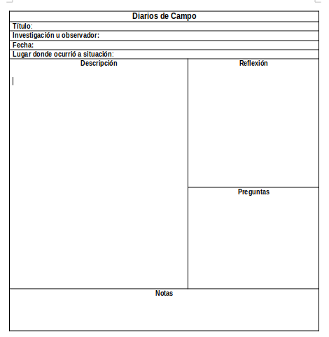
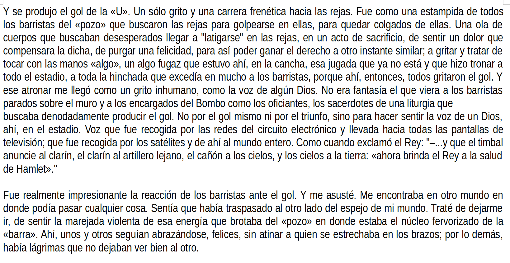
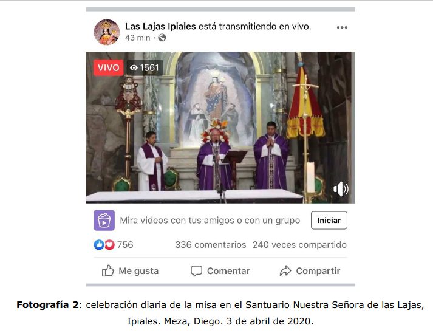
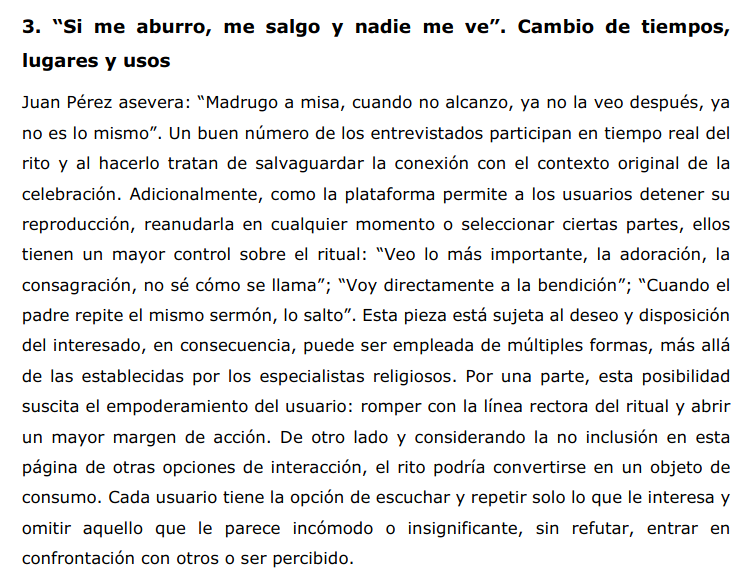

class: left, middle, bg_etnografia

```{r setup, include=FALSE}
options(htmltools.dir.version = FALSE)
knitr::opts_chunk$set(
  fig.width=9, fig.height=3.5, fig.retina=3,
  out.width = "100%",
  cache = FALSE,
  echo = FALSE,
  message = FALSE, 
  warning = FALSE,
  hiline = TRUE
)
```

```{r xaringan-themer, include=FALSE, warning=FALSE}
library(xaringanthemer)
style_duo_accent(
  primary_color = "#b01333",
  secondary_color = "#085e9f",
  inverse_header_color = "#FFFFFF"
)
```

```{css, echo=F}
h1, h2, h3 {
  text-align: center;
}

.bg_etnografia {
  position: relative;
  z-index: 1;
}
.bg_etnografia::before {
  content: "";
  background-image: url('https://images.unsplash.com/photo-1529156069898-49953e39b3ac?w=1400');
  background-size: cover;
  background-position: center;
  position: absolute;
  top: 0px; right: 0px; bottom: 0px; left: 0px;
  opacity: 0.15;
  z-index: -1;
}

.definition-box {
  background: #fdf2f3;
  border-left: 5px solid #b01333;
  border-radius: 0 8px 8px 0;
  padding: 14px 18px;
  margin: 10px 0;
  font-size: 0.88em;
}
.highlight-box {
  background: #fef9e7;
  border: 2px solid #f39c12;
  border-radius: 8px;
  padding: 12px 16px;
  margin: 12px 0;
  font-size: 0.85em;
}
.info-box {
  background: #eaf2fb;
  border-left: 5px solid #085e9f;
  border-radius: 0 8px 8px 0;
  padding: 12px 16px;
  margin: 12px 0;
  font-size: 0.85em;
}
.two-col {
  display: grid;
  grid-template-columns: 1fr 1fr;
  gap: 20px;
  align-items: start;
}
.three-col {
  display: grid;
  grid-template-columns: 1fr 1fr 1fr;
  gap: 16px;
}
.card {
  background: white;
  border-radius: 10px;
  padding: 14px;
  box-shadow: 0 2px 8px rgba(176,19,51,0.12);
  font-size: 0.84em;
}
.card-red   { border-top: 4px solid #b01333; }
.card-blue  { border-top: 4px solid #085e9f; }
.card-green { border-top: 4px solid #1e8449; }
.card-orange{ border-top: 4px solid #e67e22; }

.badge {
  display: inline-block;
  background: #b01333;
  color: white;
  border-radius: 20px;
  padding: 3px 12px;
  font-size: 0.78em;
  font-weight: bold;
  margin-right: 6px;
}
.badge-blue  { background: #085e9f; }
.badge-green { background: #1e8449; }

.step {
  display: flex;
  align-items: flex-start;
  margin-bottom: 10px;
  gap: 12px;
}
.step-num {
  background: #b01333;
  color: white;
  border-radius: 50%;
  width: 28px; height: 28px;
  display: flex;
  align-items: center;
  justify-content: center;
  font-weight: bold;
  flex-shrink: 0;
  font-size: 0.9em;
}

.footnote-small {
  font-size: 0.68em;
  color: #777;
  border-top: 1px solid #DDD;
  padding-top: 6px;
  margin-top: 6px;
}

table { font-size: 0.78em; width: 100%; border-collapse: collapse; }
th { background: #b01333; color: white; padding: 7px 10px; text-align: left; }
td { padding: 6px 10px; border-bottom: 1px solid #e0e0e0; }
tr:nth-child(even) { background: #f5f7fa; }

blockquote {
  border-left: 4px solid #b01333;
  background: #fdf2f3;
  padding: 10px 16px;
  border-radius: 0 8px 8px 0;
  font-style: italic;
  color: #333;
  margin: 10px 0;
  font-size: 0.90em;
}
```

---
class: left, middle, bg_etnografia

# Métodos Etnográficos para el Estudio de Grupos
## Psicología de los Grupos — Clase 7

**Francisco Villarroel Riquelme** | `r Sys.Date()`

---
background-image: url(clase7_files/logo_psicologia_UDD.png)
background-size: 150px
background-position: 97% 97%
class: left, top

# ¿Qué veremos hoy?

.two-col[
.card.card-red[
**Parte I: Contexto metodológico**
- ¿Qué son los métodos cualitativos?
- Diferencias clave cuali/cuanti
- Muestras cualitativas
]
.card.card-blue[
**Parte II: Etnografía**
- Conceptualización de la etnografía
- El campo y el investigador
- Etnografía digital
- Etnografía aplicada a grupos
]
]

---
class: inverse, center, middle

## Parte I: Contexto metodológico cualitativo

---
background-image: url(clase7_files/logo_psicologia_UDD.png)
background-size: 150px
background-position: 97% 97%
class: left, middle

## ¿Qué es la investigación cualitativa?

.definition-box[
_Método que se enfoca en **comprender los fenómenos**, explorándolos desde la perspectiva de los participantes en un ambiente natural y en relación con su contexto._
]

--

Se utiliza cuando se quiere analizar **puntos de vista, interpretaciones y significados**, y cuando no hay mucha investigación previa disponible.

--

> En el estudio de grupos, esto es especialmente valioso: nos permite entender **cómo viven los grupos su propia dinámica** desde adentro.

---
background-image: url(clase7_files/logo_psicologia_UDD.png)
background-size: 150px
background-position: 97% 97%
class: left, middle

## Diferencias entre paradigmas cuantitativo y cualitativo

.two-col[
.card.card-red[
**Cuantitativo**
- Busca **medir** atributos
- Acota y disecciona la realidad
- Representatividad estadística
- Hipótesis previas que se prueban
]
.card.card-blue[
**Cualitativo**
- Busca **interpretar** fenómenos
- Expande y profundiza en datos
- Riqueza y profundidad > tamaño
- Hipótesis emergentes y flexibles
]
]

--

.highlight-box[
⚠️ **¡No hay mejor método!** La elección depende de la pregunta de investigación y el estado del conocimiento en el área.
]

---
background-image: url(clase7_files/logo_psicologia_UDD.png)
background-size: 150px
background-position: 97% 97%
class: left, middle

## Muestras cualitativas

Las muestras cualitativas **no buscan representar a una población**. Se priorizan sujetos que aporten riqueza y profundidad al análisis.

--

| Tipo de muestra | Uso principal |
|---|---|
| **Expertos** | Comprensión profunda de fenómenos específicos |
| **Casos tipo** | Representar personas con un perfil muy específico |
| **Máxima variabilidad** | Mostrar diversidad de perspectivas del fenómeno |
| **Homogénea** | Lograr saturación con perfiles similares |
| **Bola de nieve** | Contacto a través de informantes clave que reclutan más |
| **Casos extremos** | Estudiar fenómenos atípicos o marginales |

--

.info-box[
🎯 Se busca el **proceso de saturación**: el punto en que nuevos casos ya no agregan información nueva al análisis.
]

---
class: inverse, center, middle

## Parte II: Etnografía

---
background-image: url(clase7_files/logo_psicologia_UDD.png)
background-size: 150px
background-position: 97% 97%
class: left, middle

## Etnografía: definición

> _"La etnografía es el trabajo de **describir una cultura**. Tiende a comprender otra forma de vida desde el punto de vista de los que la viven [...] Más que «estudiar a la gente», la etnografía significa **«aprender de la gente»**. El núcleo central de la etnografía es la preocupación por captar el significado de las acciones y los sucesos para la gente que tratamos de comprender."_

.footnote-small[Spradley, 1979, p. 3]

--

.definition-box[
Se trata de una **investigación iterativa-inductiva** (que evoluciona en su diseño a lo largo del estudio), que reconoce el rol de la teoría y del investigador, y que considera a los seres humanos como parte objeto/parte sujeto (O'Reilly, 2005).
]

---
background-image: url(clase7_files/logo_psicologia_UDD.png)
background-size: 150px
background-position: 97% 97%
class: left, middle

## Etnografía: objetivo

> _"El propósito de la investigación etnográfica es describir y analizar lo que las personas de un sitio, estrato o contexto determinado hacen usualmente [...] así como los significados que le dan a ese comportamiento realizado en circunstancias comunes o especiales, y presentar los resultados de manera que se resalten las regularidades que implica un proceso cultural."_

--

La etnografía tiene una **triple acepción**:

.three-col[
.card.card-red[
**Enfoque**  
Perspectiva epistemológica de comprensión desde adentro
]
.card.card-blue[
**Método**  
Conjunto de técnicas de observación y recolección de datos
]
.card.card-green[
**Texto**  
Producto final: el informe etnográfico  
(Guber, 2001)
]
]

---
background-image: url(clase7_files/logo_psicologia_UDD.png)
background-size: 150px
background-position: 97% 97%
class: left, middle

## Características de la investigación etnográfica

.two-col[
.card.card-red[
**Epistemológicas**

<div class="step"><div class="step-num">1</div><div>Preguntas para entender estructura, patrones de comportamiento y funciones</div></div>
<div class="step"><div class="step-num">2</div><div>Es interpretativa, reflexiva y constructuvista</div></div>
<div class="step"><div class="step-num">3</div><div>Datos interpretados "desde dentro"</div></div>
<div class="step"><div class="step-num">4</div><div>Armar un rompecabezas desde una visión holística</div></div>
]
.card.card-blue[
**Técnicas y prácticas**

<div class="step"><div class="step-num">5</div><div>Observación directa como participante</div></div>
<div class="step"><div class="step-num">6</div><div>Énfasis en interacciones sociales</div></div>
<div class="step"><div class="step-num">7</div><div>Mapear el contexto físico y digital del campo</div></div>
<div class="step"><div class="step-num">8</div><div>Permite integrar otros métodos (entrevistas, grupos focales, etc.)</div></div>
]
]

---
background-image: url(clase7_files/logo_psicologia_UDD.png)
background-size: 150px
background-position: 97% 97%
class: left, middle

## El campo

> _"No solo se trata de «ir» a un lugar, sino a su vez de una manera de «estar» y mucho más aún de una forma de «posicionarse» en el campo. Para algunos «el trabajo de campo es un ejercicio de papeles múltiples»."_

--

.two-col[
.card.card-red[
**¿Qué es el campo?**
- El "lugar" donde los actores sociales despliegan su vida
- Es el referente empírico de la investigación
- Puede ser físico, digital, o ambos
]
.card.card-blue[
**Unidades de análisis posibles**
- Individuos, organizaciones, grupos
- Redes sociales, comunidades, culturas
- Prácticas individuales, compartidas o relacionales
- Entorno físico y cultura material
]
]

---
background-image: url(clase7_files/logo_psicologia_UDD.png)
background-size: 150px
background-position: 97% 97%
class: left, middle

## El investigador en el campo

.two-col[
.card.card-red[
**Cómo entrar**
- Elegir una comunidad o campo específico
- Se prioriza **intensividad** por sobre extensividad
- Llegar por medio de **informantes clave**
- Señalar que estás haciendo investigación → consentimiento
]
.card.card-blue[
**Cómo estar**
- Si es observación participante: integrarse paulatinamente
- Ser amable y empático
- Elaborar una historia o guión de investigación
- Ojo con las expectativas del grupo sobre el investigador
]
]

---
background-image: url(clase7_files/logo_psicologia_UDD.png)
background-size: 150px
background-position: 97% 97%
class: left, middle

## Etnografía aplicada al estudio de grupos

.info-box[
En psicología de grupos, la etnografía permite observar los **procesos grupales en acción**, no solo los reportes retrospectivos de los participantes.
]

--

.two-col[
.card.card-red[
**¿Qué se puede observar?**
- Dinámicas de liderazgo emergente
- Patrones de comunicación y turnos de habla
- Conformidad, disidencia y presión social
- Rituales grupales y construcción de identidad colectiva
- Manejo de conflictos y toma de decisiones
]
.card.card-blue[
**Ventaja frente a otros métodos**
- Captura comportamientos **no verbalizados**
- Permite ver la brecha entre lo que el grupo *dice* que hace y lo que *realmente* hace
- Accede a normas tácitas e implícitas
- Documenta la evolución del grupo **en el tiempo**
]
]

---
background-image: url(clase7_files/logo_psicologia_UDD.png)
background-size: 150px
background-position: 97% 97%
class: left, middle

## Roles del investigador en la observación de grupos

Los distintos roles del observador implican distintos niveles de inmersión e implicación:

--

| Rol | Descripción | Ventaja | Riesgo |
|---|---|---|---|
| **Observador puro** | No participa, solo registra | Neutralidad | Poca accesibilidad |
| **Observador participante** | Participa parcialmente | Acceso a prácticas cotidianas | Influencia en el grupo |
| **Participante observador** | Integrado al grupo, observa | Acceso total a dinámicas internas | Pérdida de distancia analítica |

--

.highlight-box[
⚠️ En el estudio de grupos, el investigador siempre altera de algún modo las dinámicas que observa. Esto no invalida la investigación, pero **debe ser reflexionado y documentado** en el diario de campo.
]

---
class: inverse, center, middle

## Etnografías digitales

---
background-image: url(clase7_files/logo_psicologia_UDD.png)
background-size: 150px
background-position: 97% 97%
class: left, middle

## Lo "digital" en las interacciones

.two-col[
.card.card-red[
**Transformaciones del campo**
- Aparecimiento de comunidades digitales
- El concepto de "campo" se vuelve difuso
- No hay un campo preexistente: el investigador lo construye

> _"No existe un campo preexistente al que el investigador llega, sino una variedad de formas de conexión no anticipadas que el etnógrafo ha de explorar."_
.footnote-small[Hine, 2015; Postill & Pink, 2012]
]
.card.card-blue[
**Elementos clave**
- **Sociabilidad por afinidad**: grupos que se forman en torno a intereses compartidos
- Las comunidades digitales son muy flexibles y cambiantes
- **Datificación de prácticas sociales**: sistemas de estatus, likes, seguidores
- Mecanismos de reconocimiento y frustración visibles
]
]

---
background-image: url(clase7_files/logo_psicologia_UDD.png)
background-size: 150px
background-position: 97% 97%
class: left, middle

## Registro en etnografía

.two-col[
.card.card-red[
**Herramientas de registro**
- Notas de campo escritas (diario de campo)
- Fotografías para graficar elementos visuales
- Notas de voz (no deben pasar del mismo día)
- Transcripción de audio: herramientas de IA como *gladia.io*
]
.card.card-blue[
**El diario de campo**
- Registro de observaciones
- Reflexiones propias e interrogantes emergentes
- Descripciones de interacciones y ambiente
- Hipótesis provisionales que van surgiendo
]
]

---

```{r, out.width="55%", fig.align='center'}

```

---
class: inverse, center, middle

## Formas de reportar la información

---

```{r, out.width="80%", fig.align='center'}

```

---

```{r, out.width="70%", fig.align='center'}

```

---

```{r, out.width="70%", fig.align='center'}

```

---
background-image: url(clase7_files/logo_psicologia_UDD.png)
background-size: 150px
background-position: 97% 97%
class: left, middle

## Ejercicio práctico: etnografiar un grupo

--

**Salir a etnografiar un grupo en acción:**

--

<div class="step"><div class="step-num">1</div><div><strong>Seleccione su campo</strong>: un grupo reunido en algún lugar (cafetería, sala de espera, patio, espacio digital)</div></div>

<div class="step"><div class="step-num">2</div><div><strong>Analice cómo interactúa el grupo</strong>: ¿quiénes hablan y quiénes no? ¿hay un líder emergente? ¿qué dice el lenguaje no verbal?</div></div>

<div class="step"><div class="step-num">3</div><div><strong>Anote todo lo que observa</strong>, incluyendo sus propios pensamientos y preguntas que van surgiendo</div></div>

<div class="step"><div class="step-num">4</div><div><strong>Déjese asombrar</strong>: lo obvio también merece ser anotado</div></div>

--

.highlight-box[
⏱ Nos vemos en **media hora** a conversar sobre sus resultados. ¿Qué dinámica de grupo pudieron observar?
]

---
background-image: url(clase7_files/logo_psicologia_UDD.png)
background-size: 150px
background-position: 97% 97%
class: left, middle

## Síntesis de la clase

.three-col[
.card.card-red[
**Métodos cualitativos**
- Comprenden fenómenos desde la perspectiva de los participantes
- No buscan representar, sino profundizar
- Exigen habilidades teóricas y sociales del investigador
]
.card.card-blue[
**Etnografía**
- Aprender *de* la gente, no solo *sobre* la gente
- Triple acepción: enfoque, método y texto
- Requiere presencia sostenida en el campo
]
.card.card-green[
**Etnografía de grupos**
- Permite acceder a dinámicas grupales no verbalizadas
- El rol del observador influye en el grupo estudiado
- El diario de campo es la herramienta central
]
]

---
class: inversed, center, middle
background-image: url(https://user-images.githubusercontent.com/163582/45438104-ea200600-b67b-11e8-80fa-d9f2a99a03b0.png)
background-size: 80px
background-position: 50% 90%

# ¡Gracias!

### fvillarroelr@udd.cl

Slide creado con el paquete [**xaringan**](https://github.com/yihui/xaringan).

El chakra viene de [remark.js](https://remarkjs.com), [**knitr**](https://yihui.org/knitr/), y [R Markdown](https://rmarkdown.rstudio.com).