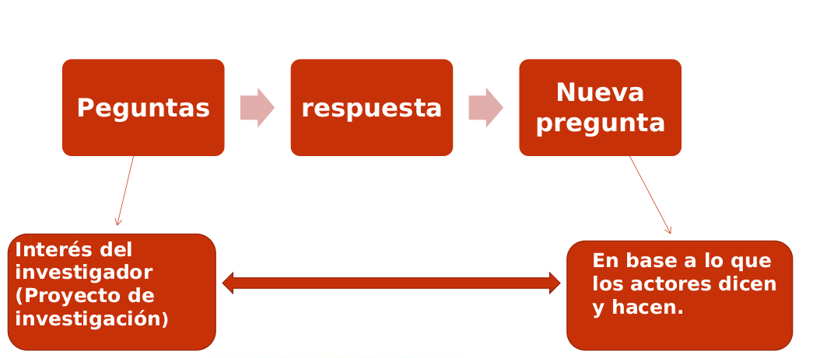
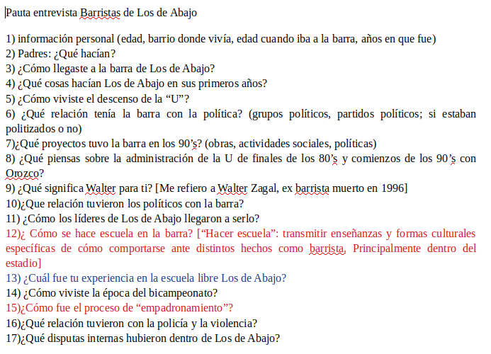
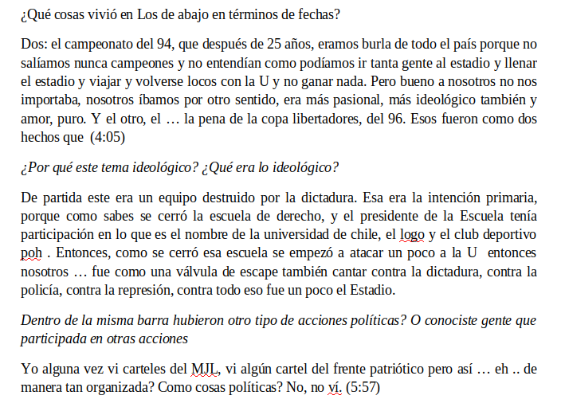
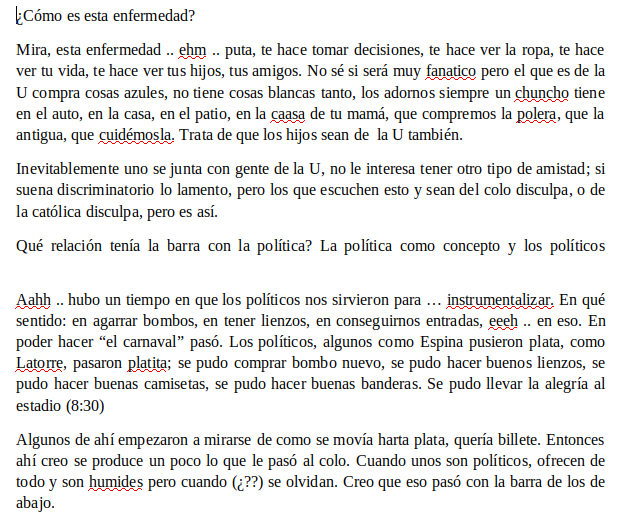

class: left, middle, bg_karl

```{r setup, include=FALSE}
options(htmltools.dir.version = FALSE)
knitr::opts_chunk$set(
  fig.width=9, fig.height=3.5, fig.retina=3,
  out.width = "100%",
  cache = FALSE,
  echo = FALSE,
  message = FALSE, 
  warning = FALSE,
  hiline = TRUE
)
```

```{r xaringan-themer, include=FALSE, warning=FALSE}
library(knitr)
library(xaringanthemer)
style_duo_accent(
  primary_color = "#b01333",
  secondary_color = "#085e9f",
  inverse_header_color = "#FFFFFF"
)
```

```{css, echo=F}
h1, h2, h3 {
  text-align: center;
}
.bg_karl {
  position: relative;
  z-index: 1;
}
.bg_karl::before {
  content: "";
  background-image: url('https://www.pewresearch.org/wp-content/uploads/2022/10/3-header_howPollingWorks.jpg');
  background-size: cover;
  background-position: center;
  position: absolute;
  top: 0px; right: 0px; bottom: 0px; left: 0px;
  opacity: 0.1;
  z-index: -1;
}
.definition-box {
  background: #fdf2f3;
  border-left: 5px solid #b01333;
  border-radius: 0 8px 8px 0;
  padding: 14px 18px;
  margin: 10px 0;
  font-size: 0.88em;
}
.highlight-box {
  background: #fef9e7;
  border: 2px solid #f39c12;
  border-radius: 8px;
  padding: 12px 16px;
  margin: 12px 0;
  font-size: 0.85em;
}
.info-box {
  background: #eaf2fb;
  border-left: 5px solid #085e9f;
  border-radius: 0 8px 8px 0;
  padding: 12px 16px;
  margin: 12px 0;
  font-size: 0.85em;
}
.two-col {
  display: grid;
  grid-template-columns: 1fr 1fr;
  gap: 20px;
  align-items: start;
}
.three-col {
  display: grid;
  grid-template-columns: 1fr 1fr 1fr;
  gap: 16px;
}
.card {
  background: white;
  border-radius: 10px;
  padding: 14px;
  box-shadow: 0 2px 8px rgba(176,19,51,0.12);
  font-size: 0.84em;
}
.card-red   { border-top: 4px solid #b01333; }
.card-blue  { border-top: 4px solid #085e9f; }
.card-green { border-top: 4px solid #1e8449; }
.card-orange{ border-top: 4px solid #e67e22; }
.badge {
  display: inline-block;
  background: #b01333;
  color: white;
  border-radius: 20px;
  padding: 3px 12px;
  font-size: 0.78em;
  font-weight: bold;
  margin-right: 6px;
}
.badge-blue  { background: #085e9f; }
.badge-green { background: #1e8449; }
.step {
  display: flex;
  align-items: flex-start;
  margin-bottom: 10px;
  gap: 12px;
}
.step-num {
  background: #b01333;
  color: white;
  border-radius: 50%;
  width: 28px; height: 28px;
  display: flex;
  align-items: center;
  justify-content: center;
  font-weight: bold;
  flex-shrink: 0;
  font-size: 0.9em;
}
.footnote-small {
  font-size: 0.68em;
  color: #777;
  border-top: 1px solid #DDD;
  padding-top: 6px;
  margin-top: 6px;
}
table { font-size: 0.78em; width: 100%; border-collapse: collapse; }
th { background: #b01333; color: white; padding: 7px 10px; text-align: left; }
td { padding: 6px 10px; border-bottom: 1px solid #e0e0e0; }
tr:nth-child(even) { background: #f5f7fa; }
blockquote {
  border-left: 4px solid #b01333;
  background: #fdf2f3;
  padding: 10px 16px;
  border-radius: 0 8px 8px 0;
  font-style: italic;
  color: #333;
  margin: 10px 0;
  font-size: 0.90em;
}
```

# Metodología de la Investigación
## Clase 11: Grupos focales y grupos de discusión

<br>

#### Francisco Villarroel Riquelme (CICS-UDD)

<br><br><br>

```{r, echo=FALSE, message=FALSE, out.width="30%", fig.align='center'}
knitr::include_graphics("clase8_files/logo_psicologia_UDD.png")
```

---
background-image: url(clase8_files/logo_psicologia_UDD.png)
background-size: 150px
background-position: 97% 97%
class: left, top

# ¿Qué veremos hoy?

.two-col[
.card.card-red[
**Técnicas grupales**

- Grupo focal y grupo de discusión
- Diferencias fundamentales entre ambas
]
.card.card-blue[
**Diseño y ejecución**

- Cómo diseñar grupos focales para distintos fines
- Consejos para llevarlos con rigurosidad
]
]

<br>

.card.card-green[
**Construcción de cuestionarios**

- Cómo formular preguntas desde la teoría
- Criterios para estructurar la pauta de preguntas
- Aplicación práctica a grupos focales
]

---
background-image: url(clase8_files/logo_psicologia_UDD.png)
background-size: 150px
background-position: 97% 97%
class: inverse, center, middle

## Saber v/s deber

--

### ¿Qué diferencia sustancial hay entre "saber cosas" y "saber cómo uno debe ser" frente a diferentes situaciones?

---
background-image: url(clase8_files/logo_psicologia_UDD.png)
background-size: 150px
background-position: 97% 97%
class: left, middle

## Saber

> _Saber refiere a todas las formas de conocimiento común, y a lo que habitualmente se entiende como "percepción, visión, o perspectiva del actor"_

.two-col[
.info-box[
**Contenido del saber**

Son los saberes comunes, los sentidos típicos de acción, los esquemas de actuación y las observaciones de actos típicos.
]
.definition-box[
**Propósito**

Busca comprender el **sentido mentado de la acción**: por qué las personas hacen lo que hacen desde su propia perspectiva.
]
]

---
background-image: url(clase8_files/logo_psicologia_UDD.png)
background-size: 150px
background-position: 97% 97%
class: left, middle

## Deber

> _Contracara de los ideales. Formas de representación de la comunidad y su "moral"_

.two-col[
.definition-box[
**¿Qué es el deber?**

A diferencia del saber, son los modos de hacer, pensar y existir que se imponen desde el exterior.
]
.highlight-box[
**En la práctica**

Es lo **bueno**, lo **correcto** o lo **"normal"**: el conjunto de normas sociales que regulan la conducta del grupo.
]
]

---
background-image: url(clase8_files/logo_psicologia_UDD.png)
background-size: 150px
background-position: 97% 97%
class: inverse, center, middle

# Grupos focales y grupos de discusión

---
background-image: url(clase8_files/logo_psicologia_UDD.png)
background-size: 150px
background-position: 97% 97%
class: left, middle

## Grupo de discusión

> _"Nos informa de las racionalizaciones con que un grupo se representa a sí mismo"_

--

.two-col[
.card.card-red[
**¿Qué es?**

- Grupos de personas interrogadas sobre símbolos o significados de su comunidad
- Dos o más personas que al hablar generan _un discurso_
- El discurso es la puesta en habla de un lenguaje común
]
.card.card-blue[
**¿Para qué sirve?**

- Descubre los códigos para interpretar el mundo
- Revela la forma hablada del lenguaje colectivo
- Muestra las bases de juicios y prejuicios del grupo
]
]

---
background-image: url(clase8_files/logo_psicologia_UDD.png)
background-size: 150px
background-position: 97% 97%
class: left, middle

## ¿Cómo facilitar el discurso del grupo?

--

.card.card-red[
El grupo de discusión **devela el lenguaje de una comunidad**, lo que permite que sus miembros enjuicien la realidad en base a sus propios códigos.
]

<br>

.three-col[
.info-box[
**Habla normativa**

Esos juicios se basan en un "deber ser" o ideal compartido
]
.definition-box[
**No lo que hacen**

No informan de sus acciones, sino de las bases de sus juicios
]
.highlight-box[
**Código colectivo**

Se expresan los prejuicios y valores del grupo como unidad
]
]

---
background-image: url(clase8_files/logo_psicologia_UDD.png)
background-size: 150px
background-position: 97% 97%
class: left, middle

## Funcionamiento del grupo de discusión

.two-col[
.card.card-blue[
**Estructura básica**

- Conversación con temática puesta por el investigador
- Turnos de habla igualmente distribuídos. ¡Evite el monopolio!
- Personas en igual condición pero con roles diferentes
- **Deben ser personas que no se conocen**
]
.card.card-red[
**Condiciones clave**

- A pesar de no conocerse, generan lenguaje común
- El tema debe ser apropiado y **apropiable**
- La conversación se dirige desde dentro
- Provocar sin conducir el discurso
]
]

---
background-image: url(clase8_files/logo_psicologia_UDD.png)
background-size: 150px
background-position: 97% 97%
class: left, middle

## Fases del proceso — I

.three-col[
.card.card-red[
**<span class="step-num" style="display:inline-flex">1</span> Nadie se conoce**

Personas disgregadas, a lo sumo conversación con quien está al lado. Lo único en común: que los convocaron.
]
.card.card-blue[
**<span class="step-num" style="display:inline-flex">2</span> Polarización**

Todo gira en torno al investigador. No existe grupalidad todavía. El investigador resigna su posición y **invita a conversar libremente**.
]
.card.card-green[
**<span class="step-num" style="display:inline-flex">3</span> Introducción del tema**

El investigador propone el tema sin dirigirlo. Crisis de mando: el silencio presiona, y la tensión lleva a que alguien tome la iniciativa.
]
]

---
background-image: url(clase8_files/logo_psicologia_UDD.png)
background-size: 150px
background-position: 97% 97%
class: left, middle

## Fases del proceso — II

.two-col[
.card.card-orange[
**<span class="step-num" style="display:inline-flex">4</span> Tejido del discurso**

Las personas comienzan a tejer su discurso. Ya no buscan guía, pero sí validación del investigador. Luego se gira en torno al resto: **se forma un grupo**.
]
.card.card-red[
**<span class="step-num" style="display:inline-flex">5</span> Texto compartido**

Se despliega el discurso y la lengua social común. La evidencia del consenso. Hasta los hablantes más pasivos se integran.
]
]

---
background-image: url(clase8_files/logo_psicologia_UDD.png)
background-size: 150px
background-position: 97% 97%
class: left, middle

## Grupo focal

> _"El grupo focal nos informará de las racionalidades que organizan la acción"_

.two-col[
.definition-box[
**¿En qué se diferencia?**

- Mayor directividad y rol activo del investigador
- La dirección es **continua**, mientras que en el grupo de discusión la ejerce el propio grupo
- Basado en el método de entrevistas focalizadas de **Merton**
]
.info-box[
**¿Qué estudia?**

- La _experiencia vivida_
- Comprensión y representación de lo que **hace** el sujeto
- Las racionalidades que organizan la acción colectiva
]
]

---
background-image: url(clase8_files/logo_psicologia_UDD.png)
background-size: 150px
background-position: 97% 97%
class: left, middle

## Ámbitos de estudio del grupo focal

.three-col[
.card.card-red[
**Vivencias y acciones**

No constituye hechos, sino vivencias: son dominios subjetivos de la experiencia vivida.
]
.card.card-blue[
**Perspectiva del actor**

Busca analizar e interpretar sentidos de acción. Accede al conjunto de saberes con que los actores se orientan.
]
.card.card-green[
**Racionalidades**

Útil para entender lógicas de acción de un colectivo. Es principalmente una entrevista focalizada **pluri-individual**.
]
]

---
background-image: url(clase8_files/logo_psicologia_UDD.png)
background-size: 150px
background-position: 97% 97%
class: left, middle

## Testimonio y habla en el grupo focal

A diferencia del grupo de discusión, el grupo focal produce un conjunto de **relatos variados**:

<br>

.two-col[
.definition-box[
**Testimonio**

La individualidad debe reproducir lo mentado: que el participante diga lo que **"vio"** o **"percibió"** desde su propia experiencia.
]
.info-box[
**Narración**

Implícitamente se pide un relato, la disposición a **"contar"**. El sujeto organiza su experiencia en una secuencia narrativa.
]
]

---
background-image: url(clase8_files/logo_psicologia_UDD.png)
background-size: 150px
background-position: 97% 97%
class: left, middle

## Pauta de preguntas en el grupo focal

.card.card-blue[
No es muy distinta a un cuestionario de entrevista semiestructurada, pero tiene particularidades propias.
]

<br>

.three-col[
.card.card-red[
**Diversidad de perspectivas**

Se busca la mayor **variedad de respuestas** para la misma pregunta entre los participantes.
]
.card.card-blue[
**Dimensiones**

Se crean dimensiones que el investigador quiere abordar, y se construyen preguntas para cada una.
]
.card.card-orange[
**Doble dinámica**

Entre preguntas y _dentro de las preguntas_: el debate entre participantes es el dato principal.
]
]

---
background-image: url(clase8_files/logo_psicologia_UDD.png)
background-size: 150px
background-position: 97% 97%
class: inverse, center, middle

# Construcción de cuestionarios para grupos focales

---
background-image: url(clase8_files/logo_psicologia_UDD.png)
background-size: 150px
background-position: 97% 97%
class: left, middle

## Esquema general de preguntas

```{r, fig.align='center', out.width="90%"}

```

---
background-image: url(clase8_files/logo_psicologia_UDD.png)
background-size: 150px
background-position: 97% 97%
class: left, middle

## ¿De dónde surgen las preguntas?

.two-col[
.card.card-red[
**Desde la teoría**

<div class="step"><div class="step-num">1</div><div>De la teoría que construí en mi proyecto de investigación</div></div>
<div class="step"><div class="step-num">2</div><div>De los aspectos secundarios de mi teoría (otras variables independientes, variables similares a la dependiente)</div></div>
]
.card.card-blue[
**Desde la literatura y el campo**

<div class="step"><div class="step-num">3</div><div>De lo que ha señalado la literatura anterior</div></div>
<div class="step"><div class="step-num">4</div><div>De las mismas respuestas de los participantes, agregando preguntas emergentes</div></div>
]
]

---
background-image: url(clase8_files/logo_psicologia_UDD.png)
background-size: 150px
background-position: 97% 97%
class: left, middle

## Criterios para estructurar el cuestionario

.two-col[
.definition-box[
**De lo más amplio a lo más específico**

Es necesario capturar contexto y refrescar memoria antes de ir a cuestiones puntuales.
]
.info-box[
**De lo más superficial a lo más profundo**

Se parte por cosas sencillas —en memoria, emociones e interpretación— antes de ahondar.
]
]

.two-col[
.highlight-box[
**De lo más impersonal a lo más personalizado**

Primero temas donde las personas se sientan ajenas, hasta llegar a su propia experiencia.
]
.definition-box[
**De lo informativo a lo interpretativo**

Partir de datos concretos y avanzar hacia la interpretación que los participantes hacen de ellos.
]
]

---
background-image: url(clase8_files/logo_psicologia_UDD.png)
background-size: 150px
background-position: 97% 97%
class: left, middle

## Tipos de preguntas para grupos focales

.three-col[
.card.card-red[
**Preguntas de apertura**

Rompen el hielo. No son analíticas; buscan que todos hablen. Ej.: _"¿Cómo llegaron a ser parte de este grupo?"_
]
.card.card-blue[
**Preguntas de introducción**

Presentan el tema general. Activan recuerdos o asociaciones iniciales. Ej.: _"¿Qué viene a su mente cuando piensan en X?"_
]
.card.card-green[
**Preguntas de transición**

Conectan el tema amplio con el foco. Llevan la conversación hacia las preguntas clave.
]
]

<br>

.two-col[
.card.card-orange[
**Preguntas clave**

Son el núcleo del cuestionario: responden directamente a los objetivos. Se dedica más tiempo a estas (2–5 preguntas).
]
.card.card-red[
**Preguntas de cierre**

Consolidan lo dicho y dan espacio a agregar algo pendiente. Ej.: _"¿Hay algo importante que no hayamos tocado?"_
]
]

---
background-image: url(clase8_files/logo_psicologia_UDD.png)
background-size: 150px
background-position: 97% 97%
class: left, middle

## Durante la sesión: reglas de oro

.card.card-red[
### ⚠️ JAMÁS SESGAR PREGUNTAS INDUCIENDO RESPUESTAS
]

<br>

.two-col[
.definition-box[
**No comparta su opinión**

No le diga al participante qué piensa usted frente al tema. Esto contamina la producción del dato.
]
.info-box[
**Técnicas para profundizar sin sesgar**

- _"¿Podría contarme más sobre eso?"_
- _"¿Cómo así?"_ / _"¿Qué quiere decir con...?"_
- Silencio activo: dar espacio antes de intervenir
]
]

---
background-image: url(clase8_files/logo_psicologia_UDD.png)
background-size: 150px
background-position: 97% 97%
class: left, middle

## Ejemplo: Entrevista a barristas de _Los de Abajo_

.card.card-blue[
**Los objetivos del cuestionario eran:**

1. Organización interna de los barristas
2. Formas de acción colectiva de los barristas
3. Relaciones de la barra con organizaciones políticas partidistas y no partidistas
]

---
background-image: url(clase8_files/logo_psicologia_UDD.png)
background-size: 150px
background-position: 97% 97%
class: left, middle

```{r, fig.align='center', out.width="75%"}

```

---
background-image: url(clase8_files/logo_psicologia_UDD.png)
background-size: 150px
background-position: 97% 97%
class: left, middle

```{r, fig.align='center', out.width="75%"}

```

---
background-image: url(clase8_files/logo_psicologia_UDD.png)
background-size: 150px
background-position: 97% 97%
class: left, middle

```{r, fig.align='center', out.width="65%"}

```

---
background-image: url(clase8_files/logo_psicologia_UDD.png)
background-size: 150px
background-position: 97% 97%
class: left, middle

## Muestras para grupos de discusión y focales

.two-col[
.card.card-blue[
**Composición habitual**

- Se buscan muestras **heterogéneas**: distintos atributos que muestren variedad
- También es muy válido el uso de **cuotas** según variables relevantes
]
.card.card-red[
**Según el tema**

- Muestras más **homogéneas** son muy usadas cuando el objeto de estudio lo requiere
- La homogeneidad facilita la producción de un discurso compartido
]
]

---
background-image: url(clase8_files/logo_psicologia_UDD.png)
background-size: 150px
background-position: 97% 97%
class: left, middle

## Antes de la sesión: logística

.two-col[
.card.card-red[
**Convocatoria**

<div class="step"><div class="step-num">1</div><div>Definir cuántas personas por sesión (equilibrio entre volumen y participación)</div></div>
<div class="step"><div class="step-num">2</div><div>Reclutar entre 5 a 7 personas habitualmente</div></div>
<div class="step"><div class="step-num">3</div><div><strong>Siempre convocar a más:</strong> si necesito 7, convoco a 10</div></div>
]
.card.card-blue[
**Condiciones técnicas**

<div class="step"><div class="step-num">4</div><div>Los incentivos por asistencia son cada vez más frecuentes y recomendados</div></div>
<div class="step"><div class="step-num">5</div><div>Lugar cómodo, silencioso, con atención a los participantes</div></div>
<div class="step"><div class="step-num">6</div><div>Preferentemente grabar con video; si no, audio con al menos 2 dispositivos</div></div>
]
]

---
background-image: url(clase8_files/logo_psicologia_UDD.png)
background-size: 150px
background-position: 97% 97%
class: left, middle

## Tarea

.card.card-red[
**Para la próxima clase:**

1. Revisar el video sobre grupos focales
2. Identificar elementos positivos del proceso de focus group observado
3. Identificar problemas y/u obstáculos que se producen en la sesión
]

---
class: inverse, middle, center

<iframe width="660" height="415" src="https://www.youtube.com/embed/Qf8mxPIGEm8?si=SKsTCnMgvMEx5hYU" title="YouTube video player" frameborder="0" allow="accelerometer; autoplay; clipboard-write; encrypted-media; gyroscope; picture-in-picture; web-share" referrerpolicy="strict-origin-when-cross-origin" allowfullscreen></iframe>

---
background-image: url(clase8_files/logo_psicologia_UDD.png)
background-size: 150px
background-position: 97% 97%
class: left, middle

## Tarea: Búsqueda de paper

.two-col[
.card.card-red[
**Instrucciones**

1. Busque un paper relacionado a su tema de investigación
2. Revíselo y observe qué metodología usa
3. Coméntelo con el profesor para validarlo
]
.card.card-blue[
**Herramientas de búsqueda**

- [Google Académico](https://scholar.google.com/)
- [Research Rabbit](https://researchrabbitapp.com)
- [Repositorio UDD](https://biblioteca.udd.cl/)
]
]

.footnote-small[
**Revistas recomendadas:** [Communication Research](https://journals.sagepub.com/home/crx) · [Int. Journal of Advertising](https://www.tandfonline.com/journals/rina20) · [Social Media + Society](https://journals.sagepub.com/home/sms) · [News Media & Society](https://journals.sagepub.com/home/nms) · [Media Psychology](https://www.tandfonline.com/toc/hmep20/current) · [Digital Journalism](https://www.tandfonline.com/toc/rdij20/current) · [Communication & Sport](https://journals.sagepub.com/home/COM) · [Comunicación y Sociedad](https://revistas.unav.edu/index.php/communication-and-society/index) · [Cuadernos.info](https://cuadernos.info/index.php/cdi) · [Revista Latina de Comunicación Social](https://nuevaepoca.revistalatinacs.org/index.php/revista) · [Comunicación y Medios](https://comunicacionymedios.uchile.cl/) · [Perspectivas en Comunicación](https://www.perspectivasdelacomunicacion.cl/index.php/perspectivas)
]

---
class: center, middle
background-image: url(https://user-images.githubusercontent.com/163582/45438104-ea200600-b67b-11e8-80fa-d9f2a99a03b0.png)
background-size: 80px
background-position: 50% 90%

# ¡Gracias!

### fvillarroelr@udd.cl

Slide creado con el paquete [**xaringan**](https://github.com/yihui/xaringan).

El chakra viene de [remark.js](https://remarkjs.com), [**knitr**](https://yihui.org/knitr/), y [R Markdown](https://rmarkdown.rstudio.com).
